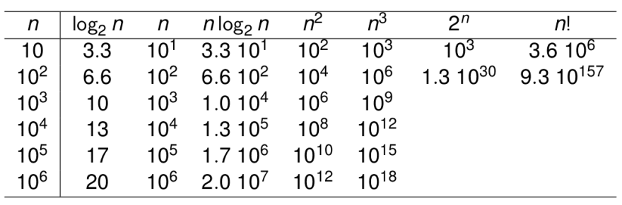

# Análise de complexidade de algoritmos 

## Complexidade de tempo

### Tamanho da entrada

Para a análise de complexidade de tempo é necessário observar o tamanho da entrada, pois quase todo algoritmo roda com mais tempo com entradas maiores.

Na maioria das vezes essa escolha pode parecer bem direta, como por exemplo, o grau de um polinômio, o número de elementos em uma lista que se quer ordenar, a dimensão das matrizes (quadradas) que se deseja multiplicar, etc.

Porém, às vezes essa escolha não é óbvia, como nos casos de teste de primalidade de um número, algoritmos de correção ortográfica, etc.

A escolha do parâmetro deve levar em consideração as características das entradas, o custo das operações, etc.

Na maioria das vezes, para entradas pequenas, é difícil distinguir qual algoritmo é mais rápido. Porém se olharmos a contagem para diferentes ordens de crescimento com entradas grandes, a diferença se torna óbvia.



### Operação básica

Operação básica é aquela considerada a mais importante no algoritmo. Essa pode ser identificada procurando a operação mais custosa, no laço mais interno. Vários algoritmos de ordenação tem a comparação como operação básica.

A ideia da análise de complexidade de tempo é determinar quantas vezes o algoritmo executa sua operação básica em entradas de tamanho n. Perceba que, sabendo a contagem de operações e o tempo para executar essa operação, pode-se determinar, de forma aproximada, o tempo de execução multiplicando esses dois valores. Obviamente, esse cálculo não leva em consideração nenhuma operação não-básica.

### Pior caso, melhor caso e caso médio

A maioria dos algoritmos não executa o mesmo número de operações para todas as entradas de um mesmo tamanho. Assim, faz sentido considerar diferentes análises para grupos de casos. Considere o algoritmo a seguir:
```
Algoritmo BuscaSequencial(A[0..n-1], K)
    //Procura por valor dado em um dado array por busca sequencial
    //Entrada: Um array A[0..n-1] e uma chave de busca K
    //Saída: O índice do primeiro elemento em A que casa com K ou -1 se nenhum elemento casar
    i <- 0
    while i < n and A[i] != K do
    i <- i + 1
    if i < n return i
    else return -1
```
Percebe-se que o tempo de execução desse algoritmo pode ser bem diferente para um mesmo tamanho de lista n.

##### Pior caso

A complexidade de pior caso de um algoritmo é aquela para as entradas com o pior desempenho dentre as entradas de tamanho n.

Para o algoritmo de busca sequencial apresentado o pior caso é se o dado buscado estiver na última posição da lista.

A análise de pior caso provê informações importantes sobre o limite superior da eficiência do algoritmo, ou seja, ela garante que para qualquer instância de tamanho n o tempo de execução não vai exceder o máximo definido por esta complexidade.

##### Melhor caso

A complexidade de melhor caso de um algoritmo é aquela para as entradas com o melhor desempenho dentre as entradas de tamanho n.

Para o algoritmo em questão o melhor caso é aquele em que o dado ocupa o primeiro elemento da lista.

A análise de melhor caso não é tão importante quanto a de pior caso, mas também não é inútil, pois é através dela que sabemos o máximo de desempenho do algoritmo. De forma geral, é incomum encontrarmos as instâncias de melhor caso, porém, isso pode acontecer em algumas situações. Por exemplo, pode acontecer de rodar o algoritmo de ordenar vetores em dados que já estão quase ordenados e este é bem próximo do melhor caso para um algoritmo bem conhecido (Insertion Sort).

##### Caso médio

Nem a análise de pior caso nem a de melhor caso representam bem o desempenho médio de um algoritmo em uma entrada típica (perceba que a entrada típica, mesmo se tratando de um mesmo algoritmo, depende da aplicação). A análise de caso médio tenta prover esta informação.

Para fazer uma análise de caso médio é necessário assumir algumas coisas sobre as instâncias de tamanho n. Na análise de caso médio da busca sequencial, por exemplo, duas suposições padrão são:

1. A probabilidade de uma busca bem sucedida é igual a p (0 <= p <= 1);

2. A probabilidade do primeiro casamento ocorrer na i-ésima posição da lista é a mesma para todo i;

3. No caso de uma busca malsucedida, o número de comparações é n com probabilidade (1 - p).

Percebe-se que a análise de caso médio é bem mais difícil que a de pior ou melhor caso. A abordagem inclui dividir as instâncias de tamanho n em classes com a mesma complexidade. Depois deve-se obter ou assumir uma distribuição de probabilidades para se encontrar a contagem esperada da operação básica. Essas suposições são difíceis de verificar para a maioria dos problemas. Por estes motivos, na maioria das vezes, foca-se na análise de pior caso.

Existe um outro tipo de análise chamada de análise amortizada que em alguns casos apresenta-se como uma alternativa a estas apresentadas.


tags: complexidade, algoritmo, teoria, computacao
