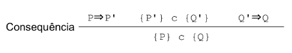
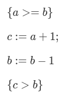
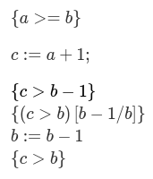

# Lógica de Hoare

## Regras de inferência - parte 0000

#### Axioma de Declaração Vazia:

#### Axioma da Atribuição:

Onde **Q[e/x]** significa a substituição (em Q) de **x** por **e**.

#### Regra da Composição:

#### Regra da Consequência:

As provas da lógica de Hoare são naturalmente construída seguindo de trás para frente. Por exemplo:

Provar que **{ a >= b } c := a + 1; b := b - 1 { c > b }**

---

temos,

Observando os dois últimos estados **{c > b}** e **b := b - 1**, vemos que é possível começar pela atribuição:

Agora, fazendo a substituição:

Fazendo atribuição novamente:

Temos, na substituição:

Usando a matemática, podemos perceber que se declararmos um valor igual para **a** e **b**, teremos:

E para um valor de **a** maior do que **b**, temos:

tags: logica, hoare, inferencia, regras
