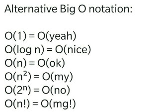
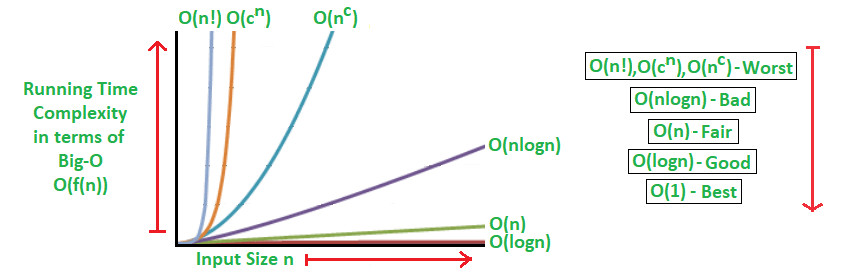

# Complexidade de algoritmos

## Notação Big O

A notação assintótica (Big O), em Ciência da Computação, é usada para classificar algoritmos em relação as mudanças de desempenho quanto ao tamanho da entrada. É um método de descrever o comportamento de limites, matematicamente falando.

A ideia é usar a letra O seguida de uma função sobre n que descreva o crescimento de um algoritmo, no gráfico. Quanto mais rapidamente crescer o número de operações para processar os itens, pior será o desempenho do algoritmo.

A complexidade **O(1) (constante)** é aquela em que não há crescimento do número de operações, pois não depende do volume de dados de entrada (n). Por exemplo: o acesso direto a um elemento de uma matriz.

A complexidade **O(log n) (logaritmo)** é aquela em que o crescimento do número de operações é menor do que o do número de itens. Exemplo: caso médio do algoritmo de busca em árvores binárias ordenadas.

A complexidade **O(n) (linear)** é aquela em que o crescimento no número de operações é diretamente proporcional ao crescimento do número de itens. Por exemplo: o algoritmo de busca em uma lista/vetor.

A complexidade **O(n log n) (linearitmica ou quasilinear)** é aquela em que é resultado das operações (log n) executada n vezes. Exemplo: o caso médio do algoritmo de ordenação Quicksort.

A complexidade **O(n^2 ) (quadrático)** é aquela que ocorre quando os itens de dados são processados aos pares, muitas vezes com repetições dentro da outra. Com dados suficientemente grandes, tendem a se tornar muito ruim. Por exemplo: o processamento de itens de uma matriz bidimensional.

A complexidade **O(2^n ) (exponencial)** é aquela em que a medida que n aumenta, o fator analisado (tempo ou espaço) aumenta exponencialmente. Não é executável para valores muito grandes e não são úteis do ponto de vista prático. Exemplo: busca em uma árvore binária não ordenada.

A complexidade **O(n!) (fatorial)** é aquela em que o número de instruções executadas cresce muito rapidamente para um pequeno número de dados. Por exemplo: um algoritmo que gere todas as possíveis permutações de uma lista.

tags: complexidade, bigO, algoritmo, limite
