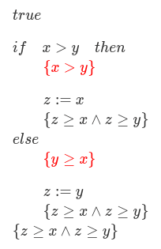
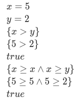
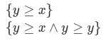

# Lógica de Hoare

## Regras de inferência - parte 0001

#### Condicional:

Lembrando que as provas da lógica de Hoare são naturalmente construída seguindo de trás para frente. Exemplo:

Provar que **{true} if x > y then z := x else z := y {z >= x ∧ z >= y}**

---

temos,

Colocando o **{Q}** ao final do **if** e do **else**:

Aplicando a afirmação do **if** a ele próprio e ao **else**:

Aqui é importante atentar que a proposição do **else** é contrária a do **if**.

Aplicando a **atribuição**, temos:

Podemos perceber que

Escolhendo um **X** maior do que o **Y**

E para

Escolhendo um **Y** maior do que o **X**

Escolhendo um **Y** e **X** iguais

Concluímos que a prova é válida.

tags: hoare, logica, else, if
