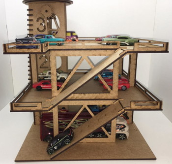
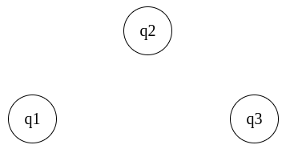
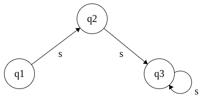
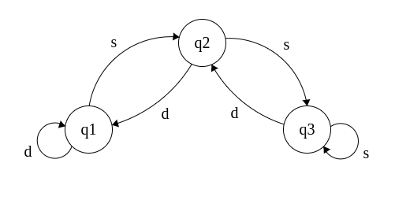

# O que é um autômato finito

Autômato finito = máquinas de estados finitos = sistemas de estados finitos

É um **modelo** usado para representar o funcionamento de diversas máquinas usadas no nosso dia a dia, como **portas automáticas**, **elevadores**, **algoritmos**, **circuitos lógicos** e **reconhecedores de linguagens regulares**.

Uma porta automática, como a mostrada na gif acima, é uma das coisas que podem ser representadas por esse modelo de autômato finito, porque ela possui **dois estados**: aquele em que a porta está **aberta** e outro em que ela está **fechada**.

Perceba que essa porta **segue** algumas **regras**:

- com a porta inicialmente **fechada**:
- se não há **nenhuma pessoa** por perto, ela continua **fechada**.
- se surge **uma pessoa**, a porta se **abre**.  

- com a porta inicialmente **aberta**:
- se não há **nenhuma pessoa** por perto, ela se **fecha**.
- se surge **uma pessoa** por perto, ela continua **aberta**.

---

## Diagrama de estados

Primeiramente temos os dois **estados**, que chamaremos de **q1** e **q2**.

**q1** para a porta **fechada**.

**q2** para a porta **aberta**.

Acrescentando as regras, temos:

Para **hp** quando há **pessoa(s)**; sendo assim a porta passa do estado **fechado** para o **aberto**. Por isso a seta vai de **q1** para **q2**.

Para **np** quando **não há pessoa(s)**; sendo assim a porta passa do estado **aberto** para o **fechado**. Por isso a seta vai de **q2** para **q1**.

Agora temos as situações em que não há mudanças de estado.

A seta que **sai e fica** em **q1** é aquela que indica que **não há pessoa(s)** próxima(s) a porta. Sendo assim a porta que está no estado **fechado**, continua **fechada**.

A seta que **sai e fica** em **q2** é aquela que indica que **há pessoa(s)** próxima(s) a porta. Sendo assim a porta que está no estado **aberto**, continua **aberta**.

---

Outro exemplo que podemos usar é o de um **estacionamento de carros com três andares**.

Observe que, para **acessar o 2º andar**, o carro terá que **passar pelo 1º** antes.

Para **acessar o 3º andar**, o carro terá que **passar pelo 1º e 2º andares** antes.

Sabendo disso, vamos montar o nosso **diagrama de estados**.

**q1**: o carro está no **1º andar**.

**q2**: o carro está no **2º andar**.

**q3**: o carro está no **3º andar**.

Para passar de um andar para o outro, o carro precisa **subir**.

Sendo assim, temos **s** para marcar a nossa **passagem de estados**.

**Subir** de **q1 para q2**.

**Subir** de **q2 para q3**.

Chegando em **q3** não há mais para onde subir, então o **estado permanece o mesmo, q3**. Por isso temos uma seta que sai e entra no mesmo estado; formando um **laço**.

Agora vamos fazer o caminho de volta; **descer**.

Agora, temos outra letra, **d**, para marcar a nossa **passagem de estados**.

**Descer** de **q3 para q2**.

**Descer** de **q2 para q1**.

Chegando em **q1** não há mais para onde descer, então o **estado permanece o mesmo, q1**. Por isso temos uma seta que sai e entra no mesmo estado; formando um **laço**.

tags: autômatos, finitos, teoria computacional, diagrama de estados
