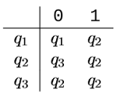

# Definição formal de um autômato finito

A **definição** formal de um **autômato finito** é uma **lista de cinco objetos**:
- conjunto de estados, 
- alfabeto de entrada, 
- regras para movimentação, 
- estado inicial, e 
- estados de aceitação. 

Em linguagem matemática uma lista de cinco elementos é frequentemente chamada **5-upla**.

Vamos usar como exemplo o **diagrama de estado** de um **autômato finito M1**, abaixo:

Ele possui **3 estados** (os círculos). Logo seu **conjunto de estados** é:

**Q = {q1, q2, q3}**

Ele também possui **2 símbolos** permitidos de entrada (números nas setas), que constituem o seu **conjunto de alfabeto**.

**Σ = {0, 1}**

Possui a **função de transição**:

Que definine as **regras para a movimentação**. Para o nosso exemplo (M1), temos:

No estado **q1** quando o **símbolo de entrada** é **1**, ocorre a **transição** para **q2**.

No estado **q1** quando o **símbolo de entrada** é **0**, não ocorre a **transição**; isso é indicado pelo **laço** (seta que entra e sai no mesmo estado) no próprio **q1**.

No estado **q2** quando o **símbolo de entrada** é **1**, não ocorre a **transição**; isso é indicado pelo **laço** no próprio **q2**.

No estado **q2** quando o **símbolo de entrada** é **0**, ocorre a **transição** para **q3**.

No estado **q3** quando o **símbolo de entrada** é **1** ou **0**, ocorre a **transição** para **q2**.

Logo,

Possui um **estado inicial (q0)**, indicado pelo **ponteiro** em **q1**.

Possui um conjunto de **estados de aceitação** ou **estados finais**.

**F = {q2}**

tags: definição, conjunto, autômato finito
