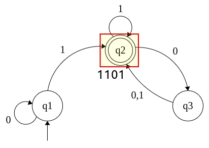

# Linguagem regular

Uma **linguagem** é chamada de **linguagem regular** se algum autômato a reconhece.

Considere o autômato finito **M1**:

Alimentando **M1** com a **cadeia** de entrada **1101**, o processamento acontece da seguinte forma:

1. Começamos pelo estado **q1**.

2. lê **1** e segue a **transição** de **q1 para q2**.

3. lê o próximo **1** e a **transição** ocorre sem mudança de estado, por causa do laço. Permanece em **q2**

4. lê **0** e segue a **transição** de **q2 para q3**.

5. lê **1** e segue a **transição** de **q3 para q2**.

6. A cadeia é **aceita**, pois ela **terminou** em um **estado marcado como de aceitação**.

Experimentando com essa máquina uma variedade de cadeias de entrada, ela revela que **aceita** as cadeias **1**, **01**, **11** e **0101010101**. 

Na verdade, **M1 aceita qualquer cadeia que termina com um 1**, pois ela vai para seu **estado de aceitação (q2)** sempre que lê o símbolo **1**.

**M1** também aceita as cadeias **100**, **0100**, **110000** e **0101000000**, e qualquer cadeia que termine com um número par de **0’s após o último 1**.

Se **A** é o **conjunto de todas as cadeias que uma máquina M aceita**, dizemos que **A** é a **linguagem** da máquina **M** e escrevemos **L(M) = A**.

Assim, dizemos que **M reconhece A** ou que **M aceita A**. 

Uma máquina **pode aceitar diversas cadeias**, mas ela **sempre reconhece apenas uma linguagem**.

Se a máquina **não aceita nenhuma cadeia**, ela ainda reconhece uma linguagem: a **linguagem vazia { }**.

Sendo assim, para **M1** temos:

**A = {w | w termina com um 1 ou termina com um número par de 0's após o último 1.}**

----

Considere o autômato finito **M2**:

Alimentando **M2** com a **cadeia** de entrada **1100**, o processamento acontece da seguinte forma:

1. Começamos pelo estado **q1**.

2. lê **1** e segue a **transição** de **q1 para q2**.

3. lê o próximo **1** e a **transição** ocorre sem mudança de estado, por causa do laço. Permanece em **q2**.

4. lê **0** e segue a **transição** de **q2 para q1**.

5. lê o próximo **0** e a **transição** ocorre sem mudança de estado, por causa do laço. Permanece em **q1**.

6. A cadeia é **rejeitada**, pois ela **não terminou** em um **estado marcado como de aceitação**.

Após fazer alguns testes, é possível perceber que **M2 aceita todas as cadeias que terminam com um 1**. Logo,

**L(M2) = {w | w termina com um 1.}**

----

Considere o autômato finito **M3**:

Alimentando **M3** com a **cadeia** de entrada **1010**, o processamento acontece da seguinte forma:

1. Começamos pelo estado **q1**.

2. lê **1** e segue a **transição** de **q1 para q2**.

3. lê **0** e segue a **transição** de **q2 para q1**.

4. lê **1** e segue a **transição** de **q1 para q2**.

5. lê **0** e segue a **transição** de **q2 para q1**.

6. A cadeia é **aceita**, pois ela **terminou** em um **estado marcado como de aceitação**.

Note que, devido ao fato de que o **estado inicial** é também o **estado final**, **M3 aceita a cadeia vazia (ε)**.

Após fazer alguns testes, é possível perceber que **M3 aceita todas as cadeias que terminam com um 0**. Logo,

**L(M3) = {w | w é a cadeia vazia ε ou termina com um 0.}**

----

Considere o autômato finito **M4**:

Alimentando **M4** com a **cadeia** de entrada **abaa**, o processamento acontece da seguinte forma:

1. Começamos pelo estado **s**.

2. lê **a** e segue a **transição** de **s para q1**.

3. lê **b** e segue a **transição** de **q1 para q2**.

4. lê **a** e segue a **transição** de **q2 para q1**.

5. lê o próximo **a** e a **transição** ocorre sem mudança de estado, por causa do laço. Permanece em **q1**.

6. A cadeia é **aceita**, pois ela **terminou** em um **estado marcado como de aceitação**.

Após fazer alguns testes, é possível perceber que, **M4 aceita todas as cadeias que começam com 'a' e terminam com um 'a'** ou **as cadeias que começam com 'b' e terminam com 'b'**. Logo,

**L(M4) = {w | w é a cadeia que começa e termina com o mesmo símbolo.}**

----

Considere o autômato finito **M5**:

Alimentando **M5** com a **cadeia** de entrada **012\<reset>01221**, o processamento acontece da seguinte forma:

1. Começamos pelo estado **q0**.

2. lê **0** e a **transição** ocorre sem mudança de estado, por causa do laço. Permanece em **q0**.

3. lê **1** e segue a **transição** de **q0 para q1**.

4. lê **2** e segue a **transição** de **q1 para q0**.

5. lê **\<reset>** e a **transição** ocorre sem mudança de estado, por causa do laço. Permanece em **q0**.

6. lê **0** e a **transição** ocorre sem mudança de estado, por causa do laço. Permanece em **q0**.

7. lê **1** e segue a **transição** de **q0 para q1**.

8. lê **2** e segue a **transição** de **q1 para q0**.

9. lê o próximo **2** e segue a **transição** de **q0 para q2**.

10. lê **1** e segue a **transição** de **q2 para q0**.

11. A cadeia é **aceita**, pois ela **terminou** em um **estado marcado como de aceitação**.

Após fazer alguns testes, é possível perceber que, **M5 aceita todas as cadeias em que a soma de todos os números após o último \<reset> seja um número divisível por 3**. Logo,

**L(M5) = {w | a soma dos símbolos em w é 0 módulo 3, exceto que \<reset> zera a soma à esquerda dele.}**

Podemos observar que, o estado **q0** significa que a **soma até esse estado, mod 3 tem resto 0**. O estado **q1** significa que a **soma até esse estado, mod 3 tem resto 1**. O estado **q2** significa que a **soma até esse estado, mod 3 tem resto 2**.

----

Usando **M5** para um **M6**, que seja múltiplo de 100; teríamos que fazer uma máquina com 100 estados, o que é inviável.

É nesse momento que usamos a definição.

Temos A100, que é a nossa máquina **M6**, usando o mesmo alfabeto e o mesmo estado inicial e final.

Assim

**A100 = ( {q0, q1, q2, ..., q99}, {0, 1, 2, \<reset>}, δ, q0, {q0} )**

Com a seguinte **função de transição**:

**δ(qi, \<reset>) = q0**, para todo i = 0, 1, ..., 99.

Lê-se: estando em qualquer estado e tendo recebido \<reset>, ocorre a transição de qi para q0.

**δ(qi, a) = q{ (i+a) mod 100}**, para todo i = 0, 1, ..., 99 e para todo a = 0, 1, 2.

Lê-se: estando em qualquer estado e tendo recebido 0, 1 ou 2, ocorre a transição de qi para um q que é o resto da divisão por 100.

Para ilustrar esse último, vamos fazer i = 15, então temos

qi = q15

e fazemos a = 2, então

**δ(q15, 2) = q{ (15+2) mod 100}**
**δ(q15, 2) = q{ (17) mod 100}**
**17 mod 100 = 17**
**δ(q15, 2) = q17**

----

tags: autômatos, linguagem, cadeia, aceita, reconhece, transição, laço
