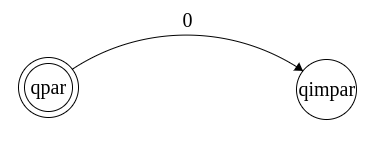

# Projetando autômatos finitos

Projetar alguma coisa é um processo criativo. Dito isso, existem várias técnicas para projetar um autômato a partir de uma linguagem dada.

Uma delas é *colocar-se* no lugar da máquina a qual está se tentando projetar.

Considere a linguagem

**L7 = { w ∈ {0,1}\* | o número de 0's em w é par }**

Sabemos que a quantidade de 0's pode ser **par** ou **ímpar**. Logo temos **2 estados**:

E que, para que o autômato reconheça a nossa linguagem, o estado final deve ser em **qpar**:

E que o alfabeto da linguagem é:

**Σ = {0, 1}**

Logo, se a cadeia lida, apresenta **até o momento um único 0**, então temos até agora um **número ímpar de 0's**.

Por isso temos a **seta** saindo do **estado de aceitação (qpar)** para o **estado qimpar**.

Se for lido um **segundo 0**, então temos, **até o momento**, um **número par de 0's**.

Então a seta se vai de **qimpar** para **qpar** (o estado de aceitação).

Os **números de 1's** pouco importa para o estado de aceitação da nossa linguagem.

Então, quando **houver vários 1's lidos no início** da cadeia e **nenhum 0**, o **número de 0's será par, pois zero é par**.

Nenhum 0 lido = zero número de 0's = zero é par

E **após ter lido um 0** ou **um número ímpar de 0's**, o número de 1's lido **não interfere** se a linguagem é aceita ou não. Por isso,

Em seguida, marcamos o estado inicial correspondente à possibilidade
associada com ter visto 0 símbolos até então (a cadeia vazia ε). 

Neste caso o estado inicial corresponde ao estado qpar porque 0 é um número par.

