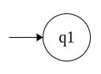

# Projetando autômatos finitos

Projetar alguma coisa é um processo criativo. Dito isso, existem várias técnicas para projetar um autômato a partir de uma linguagem dada.

Uma delas é *colocar-se* no lugar da máquina a qual está se tentando projetar.

Considere a linguagem

**L7 = { w ∈ {0,1}\* | o número de 0's em w é par }**

Sabemos que a quantidade de 0's pode ser **par** ou **ímpar**. Logo temos **2 estados**:

E que, para que o autômato reconheça a nossa linguagem, o estado final deve ser em **qpar**:

E que o alfabeto da linguagem é:

**Σ = {0, 1}**

Logo, se a cadeia lida, apresenta **até o momento um único 0**, então temos até agora um **número ímpar de 0's**.

Por isso temos a **seta** saindo do **estado de aceitação (qpar)** para o **estado qimpar**.

Se for lido um **segundo 0**, então temos, **até o momento**, um **número par de 0's**.

Então a seta se vai de **qimpar** para **qpar** (o estado de aceitação).

Os **números de 1's** pouco importam para o estado de aceitação da nossa linguagem.

Então, quando **houver vários 1's lidos no início** da cadeia e **nenhum 0**, o **número de 0's será par, pois zero é par**.

Nenhum 0 lido = zero número de 0's = zero é par

E **após ter lido um 0** ou **um número ímpar de 0's**, o número de 1's lido **não interfere** se a linguagem é aceita ou não. Por isso,

Em seguida, marcamos o estado inicial correspondente à possibilidade
associada com ter visto **0 símbolos** até então (a cadeia vazia **ε**). 

Neste caso o **estado inicial** corresponde ao estado **qpar** porque 0 é um número par.

Finalmente chegamos ao diagrama de estado de **M7**.

----

Considere a linguagem

**L8 = {w ∈ {0,1}\* | o número de 1's em w é ímpar}**

Assim como em **M7**, sabemos que a quantidade de 1's pode ser **par** ou **ímpar**. 

Então, temos **2 estados**:

E que, para que o autômato reconheça a nossa linguagem, o estado final deve ser em **qimpar**:

E que o alfabeto da linguagem é:

**Σ = {0, 1}**

Logo, se a cadeia lida, apresenta **até o momento um único 1**, então temos até agora um **número ímpar de 1's**.

Por isso temos a **seta** saindo do **estado de qpar** para o **estado de aceitação (qimpar)**.

Se for lido um **segundo 0**, então temos, **até o momento**, um **número par de 1's**.

Então a seta sai de **qimpar** (o estado de aceitação) para **qpar**.

Os **números de 0's** pouco importa para o estado de aceitação da nossa linguagem.

Então, quando **houver vários 0's lidos no início** da cadeia e **nenhum 1**, o **número de 1's será par, pois zero é par**.

Nenhum 1 lido = zero número de 1's = zero é par

E **após ter lido um 1** ou **um número ímpar de 1's**, o número de 0's lido **não interfere** se a linguagem é aceita ou não. Por isso,

Em seguida, marcamos o estado inicial correspondente à possibilidade
associada com ter visto **0 símbolos** até então (a cadeia vazia **ε**). 

Neste caso o estado inicial corresponde ao estado **qpar** porque 0 é um número par.

Finalmente chegamos ao diagrama de estado de **M8**.

----

Considere a linguagem

**L9 = {w ∈ {0,1}\* | o comprimento de w é ímpar}**

Sabemos que tamanho da cadeia pode ser **par** ou **ímpar**; não importando a **quantidade** de **0's** ou de **1's**. 

Então, temos **2 estados**:

E que, para que o autômato reconheça a nossa linguagem, o estado final deve ser em **qimpar**:

E que o alfabeto da linguagem é:

**Σ = {0, 1}**

Logo, se a cadeia lida, apresenta **até o momento um único símbolo**, então temos até agora um **número ímpar de símbolos**.

Observe que não faz diferença se o primeiro símbolo lido é 1 ou 0.

Por isso temos a **seta** saindo do **estado de qpar** para o **estado de aceitação (qimpar)** com ambos os símbolos.

Se for lido um **segundo símbolo**, então temos, **até o momento**, um **número par de símbolos**.

Então a seta sai de **qimpar** (o estado de aceitação) para **qpar**.

Em seguida, marcamos o estado inicial correspondente à possibilidade
associada com ter visto **0 símbolos** até então (a cadeia vazia **ε**). 

Neste caso o estado inicial corresponde ao estado **qpar** porque 0 é um número par.

Finalmente chegamos ao diagrama de estado de **M9**.

----

Considere a linguagem

**L10 = {w ∈ {0,1}\* | contém 001 como subcadeia de w}**

O alfabeto da linguagem é:

**Σ = {0, 1}**

Notamos aqui que devemos reconhecer um padrão, que é a subcadeia **001**. Então vamos montar os **estados** e as **transições** em cima disso.

Então temos o **estado inicial** onde não foi lido nada da cadeia.

- O primeiro símbolo que devemos reconhecer é o **primeiro 0**. 

Sendo assim, temos a **transição** que reconhece o primeiro símbolo do padrão buscado. 

A seta vai **q para q0**. Até o momento, lemos **um 0**.

- O segundo símbolo que devemos reconhecer é o **segundo 0**. 

Sendo assim, temos a **transição** que reconhece o segundo símbolo do padrão buscado. 

A seta vai de **q0 para q00**. Até aqui, lemos **dois 0's**.

- O terceiro símbolo que devemos reconhecer é o **1**. 

Sendo assim, temos a **transição** que reconhece o terceiro símbolo do padrão buscado. 

A seta vai de **q00 para q001**. Até aqui, lemos o **1 após ter lido dois 0's**.

A partir daqui, podemos perceber que não importa o número de 0's ou de 1's lidos, a cadeia já contém a subcadeia que buscamos.

Então podemos marcar o **estado de aceitação** em **q001** e as transições seguintes como um **laço**:

Caso o **primeiro símbolo lido seja 1**, ele não entra na sequência que fizemos. Por isso, criamos um **laço em q**.

Se após ler o primeiro 0, o **segundo símbolo for 1**, ele deve **sair da sequência e retornar ao início**.

Se após ler o segundo 0, o **terceiro símbolo for 0**, ele deve fazer a **transição sem a mudança de estado**, permanecendo em **q00** através do **laço**.

Finalmente chegamos ao diagrama de estado de **M10**.

----
Considere a linguagem

**L11 = {w ∈ {0,1}\* | aceita apenas a cadeia vazia}**

O alfabeto da linguagem é:

**Σ = {0, 1}**

Vamos criar o **estado inicial**:

Como queremos que ele aceite a cadeia vazia **ε**, então o estado inicial também deve ser o de **aceitação (final)**, pois enquanto o autômato não lê nada (cadeia vazia) ele é aceito pela linguagem **L11**.

Como o alfabeto é contituído de **0's e 1's**, então devemos fazer a **transição** desses.

A partir do momento em que a cadeia deixa de ser vazia, deve ocorrer a **transição para um estado comum (de não aceitação)**.

**q2** é o que chamamos de **estado morto**. Preenchemos a transição de **laço** de **q2**.

E assim, chegamos ao diagrama de estado de **M11**.

tags: autômato, projeto, linguagem regular
