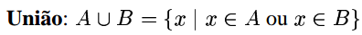
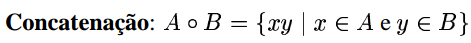
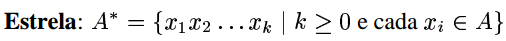

# Operações regulares

Sejam **A** e **B** linguagens, são **três** as operações sobre elas:

A **operação de união** toma **todas as cadeias** em ambas **A** e **B**, e **junta** todas em uma linguagem.

A classe das linguagens regulares é **fechada** sob a operação de união. Se **A e B são linguagens regulares**, então **A U B também** o é.

A **operação de concatenação** acrescenta uma cadeia de **A** na **frente** de uma cadeia de **B** de **todas as maneiras possíveis** para obter as cadeias na nova linguagem.

A classe das linguagens regulares é **fechada** sob a operação de concatenação. Se **A e B são linguagens regulares**, então **A o B também** o é.

A **operação estrela** se aplica a uma única linguagem ao invés de duas. Ou seja, é uma operação unária. Ela funciona juntando um número qualquer de cadeias de **A** para obter uma cadeia na nova linguagem; incluindo a possibilidade da **cadeia vazia ε**.

Exemplo:

Seja o alfabeto Σ = {a, b, c, ..., x, y, z}. Se **A** = {legal, ruim} e **B** = {homem, mulher}, então

**A U B** = {legal, ruim, homem, mulher}

**B o A** = {homem-legal, mulher-legal, homem-ruim, mulher-ruim}

**A\*** = {ε, legal, ruim, legal-legal, legal-ruim, ruim-legal, ruim-ruim, legal-legal-legal, legal-legal-ruim, legal-ruim-legal, legal-ruim-ruim}
