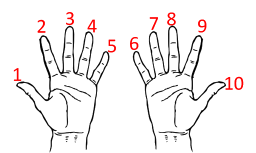
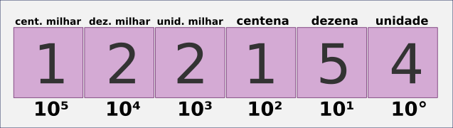

# Bases numéricas - decimal

Todas as tecnologias que usamos atualmente necessitam de sistemas de numeração diferente daquele que usamos no dia a dia (sistema decimal).

## Notação posicional

### Sistema decimal

Possivelmente esse sistema de contagem surgiu porque nós possuímos 10 dedos nas mãos.

Isso significa que para contar utilizamos uma técnica de agrupar as coisas de dez em dez, ou seja, separamos os números em grupos de dez. Por isso temos,

Com algarismo que vão de 0 a 9 para cada agrupamento.

Isso significa que o valor de cada algarismo depende da sua posição relativa na composição do número. Por isso é possível escrever o número acima de outras formas. Assim, para **122154** temos,

**cem mil** = 100 x 1000 = 1 x 100000 = **1 x 105** 
**vinte mil** = 20 x 1000 = 2 x 10000 = **2 x 104**
**dois mil** = 2 x 1000 = **2 x 103**
**cem** = 1 x 100 = **1 x 102**
**cinquenta** = 5 x 10 = **5 x 101** 
**quatro** = 4 x 1 = **4 x 100**

que equivale a

**122154** = 100000 + 20000 + 2000 + 100 + 50 + 4

ou

1 x 100000 + 2 x 10000 + 2 x 1000 + 1 x 100 + 5 x 10 + 4 x 1

ou ainda,

**1 x 105 + 2 x 104 + 2 x 103 + 1 x 102 + 5 x 101 + 4 x 100**

Todos os algarismo do número foram representados na **base dez**, que pode ser descrito **(122154)10**

