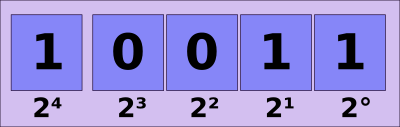
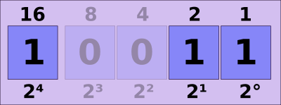
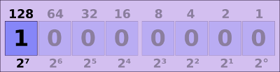
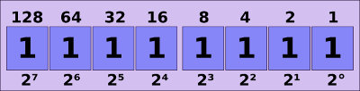
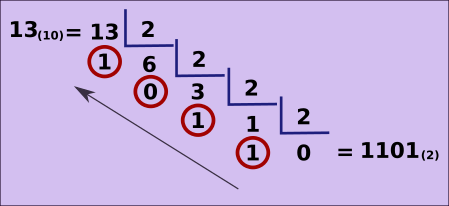
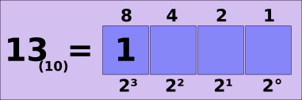
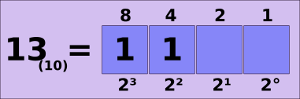
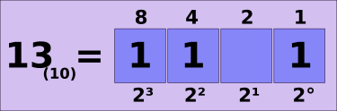
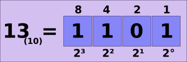

# Bases numéricas - binário

## Notação posicional

### Sistema binário

Enquanto o sistema **decimal** possui dez dígitos (0, 1, 2, 3, 4, 5, 6, 7, 8, 9). O sistema **binário** possui dois dígitos **(0, 1)**. Por isso os circuitos eletrônicos usam, pois é possível fazer a referência com a eletricidade; ligado (1) e desligado (0).

Desse modo, sabendo que, uma vez que usamos todos os algarismo do sistema decimal

```
0, 1, 2, 3, 4, 5, 6, 7, 8, 9
```

Para prosseguirmos, devemos fazer novas combinações desses em sequência, assim

```
10, 11, 12, 13, 14, 15, 16, 17, 18, 19
20, 21, 22, 23, 24, 25, 26, 27, 28, 29
30, 31, 32, 33, 34, 35, 36, 37, 38, 39
40, 41, 42, 43, 44, 45, 46, 47, 48, 49
```

seguindo infinitamente.

Do mesmo modo, temos a mesma regra para o sistema binário.

```
0 1
10 11
100 101 110 111 
1000 1001 1010 1101 1100 1101 1110 1111
```

seguindo infinitamente.

Fazendo a relação entre os sistemas decimal e binário, temos

```
0 = 0           10 = 1010
1 = 1           11 = 1101
2 = 10          12 = 1100
3 = 11          13 = 1101
4 = 100         14 = 1110
5 = 101         15 = 1111
6 = 110         16 = 1 000
7 = 111         17 = 1 0001
8 = 1000        18 = 1 0010
9 = 1001        19 = 1 0011
```

E assim por diante.

Representado o número **19<sub>(10)</sub> = 1 0011<sub>(2)</sub>** na base dois, temos,

1 0011 = **1 x 2<sup>4</sup> + 0 x 2<sup>3</sup> + 0 x 2<sup>2</sup> + 1 x 2<sup>1</sup> + 1 x 2<sup>0</sup>**

1 x 16 + 0 x 8 + 0 x 4 + 1 x 2 + 1 x 1

16 + 0 + 0 + 2 + 1 = **19**



Que pode pode ser representado de maneira mais simplificada,



**16 + 2 + 1**

Perceba que as casas que recebem zero, eu não precisei calcular, já que a multiplicação por zero resulta em zero (o termo neutro da adição).

Exemplo: representando os números **128<sub>(10)</sub>** e **255<sub>(10)</sub>** no sistema binário.

**128<sub>(10)</sub>**


**255<sub>(10)</sub>**


### Convertendo decimal para binário

Basta fazer a divisão inteira por dois sucessivamente até chegar em zero. Assim,



Dessa maneira, o número **binário** são os restos começando do último em direção ao primeiro, como mostrado na figura.

Outra maneira de fazer a conversão é usando a tabela das posições do sistema binário.

Para isso pegamos um número menor ou igual ao número que queremos converter, nesse caso, 13.

Preenchemos com o número **1** a posição,



Sabemos que essa posição vale **8** e é menor do que **13**, então ainda devemos preencher outra posição menor de valor menor do que **5**, pois **13 - 8 = 5**. Nesse caso, temos a posição de valor **4**.



A soma **8 + 4 = 12**, então falta **1** para chegar ao número que queremos. Basta preencher a posição de valor **1**.



E naquela que ficou vazia preencher com **zero**.



tags: notacao, posicional, numeracao, binario
