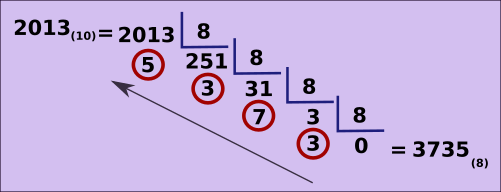

# Bases numéricas - octal

## Notação posicional

### Sistema octal

Esse sistema tem base oito, ou seja, os algarismo vão de 0 a 7.

```
0, 1, 2, 3, 4, 5, 6, 7
```

Para representação mínima, temos


O valor na parte de cima de cada quadradinho, significa o valor mínimo que cada posição representa, em decimal.

> obviamente não estamos contando aqui com o zero, que possui a mesma representação e valor em quaisquer bases numéricas.

E para representação máxima, temos


O valor na parte de cima de cada quadradinho, significa o valor máximo que cada posição representa, em decimal.

Isso significa que, tomando por exemplo a **primeira casa (8<sub>0</sub>)**, o valor mínimo a ser representado é **1(<sub>8</sub>) = 1(<sub>10</sub>)** e o valor máximo é **7(<sub>8</sub>) = 7(<sub>10</sub>)**.

Para a **segunda casa (8<sub>1</sub>)**, o valor mínimo é **1(<sub>8</sub>) = 8(<sub>10</sub>)** e o valor máximo é **7(<sub>8</sub>) = 56(<sub>10</sub>)**. E assim por diante.

Desse modo, para representar o número **137<sub>(8)</sub>**


Decompondo o número na **base 8**,

**137<sub>(8)</sub> = 1 x 8<sup>2</sup> + 3 x 8<sup>1</sup> + 7 x 8<sup>0</sup>**

**1 x 64 + 3 x 8 + 7 x 1**

**64 + 24 + 7 = 95<sub>(10)</sub>**

### Convertendo decimal para octal

Basta fazer a divisão inteira por oito sucessivamente até chegar em zero. Assim,



Dessa maneira, o número **octal** são os restos começando do último em direção ao primeiro, como mostrado na figura.

### Convertendo octal para binário

Há duas maneiras de fazer essa conversão:

Uma delas é usando o sistema **decimal** como intermediário. Assim,


Faz-se primeiramente a conversão de octal para decimal, então de decimal para binário. Como mostrado na figura acima.

Outra maneira é, sabendo que **2<sup>3</sup> = 8**, podemos pegar **cada posição do número octal** e relacioná-la a **3 posições do sistema binário**, assim, para realizar a conversão do número **375<sub>(8)</sub>**, temos

**3<sub>(8)</sub> = 011<sub>(2)</sub>**
**7<sub>(8)</sub> = 111<sub>(2)</sub>**
**5<sub>(8)</sub> = 101<sub>(2)</sub>**


Para cada casa do número octal, fazemos a associação a com três posições em binário; como mostrado na figura acima.

logo, **375<sub>(8)</sub> = 1111 1101<sub>(2)</sub>**

tags: notação posicional, sistema octal, bases numéricas
