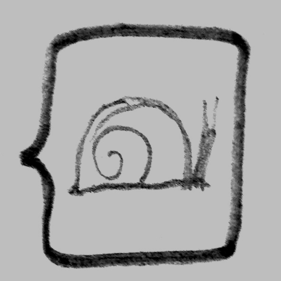

# O movimento slow web

A Fast Web é sobre informação. A **Slow Web** é sobre conhecimento.

A informação passa por você, o conhecimento vira parte de você e vai se encaixando conforme seu ritmo, com moderação, para que assim se torne aprendizado.

tags: web, slow, internet
