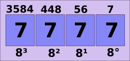
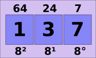
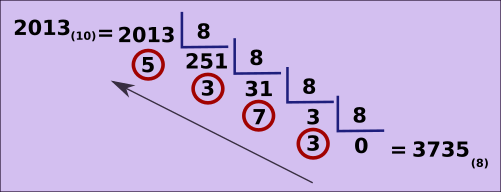
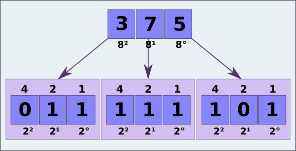

# Bases numéricas - octal

## Notação posicional

### Sistema octal

Esse sistema tem base oito, ou seja, os algarismo vão de 0 a 7.

Para representação mínima, temos

E para representação máxima, temos

Desse modo, para representar o número **137(8)**

**137(8) = 1 x 82 + 3 x 81 + 7 x 80**

**1 x 64 + 3 x 8 + 7 x 1**

**64 + 24 + 7 = 95(10)**

### Convertendo decimal para octal

Basta fazer a divisão inteira por oito sucessivamente até chegar em zero. Assim,

Dessa maneira, o número **octal** são os restos começando do último em direção ao primeiro, como mostrado na figura.

### Convertendo octal para binário

Há duas maneiras de fazer essa conversão:

Uma delas é usando o sistema **decimal** como intermediário. Assim,

Outra maneira é, sabendo que **23 = 8**, podemos pegar cada posição do número octal e relacioná-la a 3 posições do sistema binário, assim, para realizar a conversão do número **375(8)**,

**3(8) = 011(2)**
**7(8) = 111(2)**
**5(8) = 101(2)**

logo, **375(8) = 1111 1101(2)**

tags: notacao, posicional, numeracao, octal
