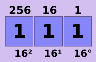
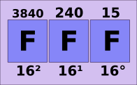
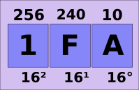
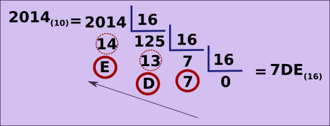
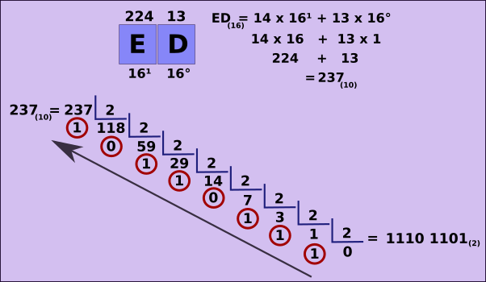
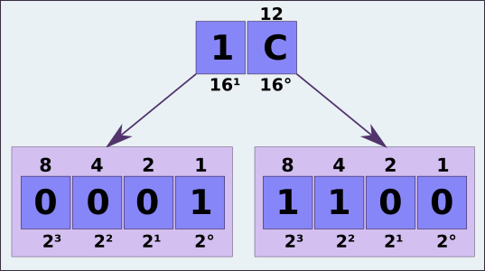

# Bases numéricas - hexadecimal

## Notação posicional

### Sistema hexadecimal

Esse sistema é representado pelos algarismo de 0 a 9 (identicos ao decimal) e pelas letras A, B, C, D, E, F. Sendo que,

**A(16) = 10(10)**
**B(16) = 11(10)**
**C(16) = 12(10)**
**D(16) = 13(10)**
**E(16) = 14(10)**
**F(16) = 15(10)**

Logo, para representação mínima, temos

E para representação máxima, temos

Desse modo, para representar o número **1FA(16)**

**1FA(16) = 1 x 162 + 15 x 161 + 10 x 160**

**1 x 256 + 15 x 16 + 10 x 1**

**256 + 240 + 10 = 506(10)**

### Convertendo decimal para hexadecimal

Basta fazer a divisão inteira por dezesseis sucessivamente até chegar em zero. Assim,

Dessa maneira, o número **hexadecimal** são os restos começando do último em direção ao primeiro, como mostrado na figura.

### Convertendo hexadecimal para binário

Há duas maneiras de fazer essa conversão:

Uma delas é usando o sistema **decimal** como intermediário. Assim,

Outra maneira é, sabendo que **24 = 16**, podemos pegar cada posição do número hexadecimal e relacioná-la a 4 posições do sistema binário, assim, para realizar a conversão do número **1C(16)**,

**1(16) = 0001(2)**
**C(16) = 12(16) = 1100(2)**

logo, **1C(16) = 1 1100(2)**

tags: notacao, posicional, numeracao, hexadecimal
