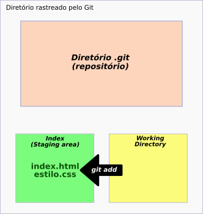
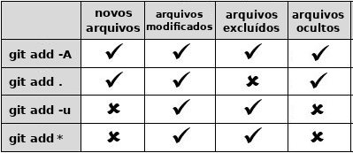

# git add: Adicionando arquivos no Git


## Iniciando o Git

Entre na pasta a qual você pretende fazer o versionamento e no terminal digite:

```
$ git init
```

Para inicializar o **Git**, caso ainda não o tenha feito.

- o símbolo **$** indica que você deve usar o **usuário comum** para fazer essa operação.

Desse modo a pasta **.git** será criada. É essa pasta que armazenará as imagens das versões do projetos criados.


## Entendendo o fluxo do Git

A partir daqui, vamos entender o fluxo do Git.

- **Working directory**: é onde estão seus arquivos que serão trabalhados. Aqui ficam os arquivos que ainda não receberam o comando *commit*.

- **Index** ou **Staging area**: é a sala de espera do Git. É aqui que ficam os arquivos que já receberam o comando *commit*.

- **Repositório**: é onde são guardados os seus *commits*.


## Git status

Vamos supor que o diretório está vazio. Então vamos verificar o estado atual do **git**. Assim:

```
$ git status
```

O retorno do terminal será algo semelhante a:


Agora vamos criar dois arquivos nesse diretório:

```
$ touch index.html estilo.css
```

- o comando **touch** serve para criar arquivos no Linux.

Digitando novamente o comando ```git status```, temos:


Esses dois arquivos ainda não estão sendo monitorados pelo **git**.

No fluxo do git, temos:


Como podemos perceber, esses dois arquivos ainda não receberam o *commit*. Por isso eles estão no **working directory**.


## Git add

Para adicionar os dois arquivos, **um de cada vez**, digite:

```
$ git add index.html
```

```
$ git add estilo.css
```

Ou para adicionar ambos **ao mesmo tempo**,

```
$ git add index.html estilo.css
```

Caso queira adicionar **todos os arquivos de um diretório recursivamente**; o que inclui seus subdiretórios e arquivos ou pastas ocultas,

```
$ git add .
```

Para adicionar todos os arquivos de uma **determinada extensão**. 

```
$ git add *.txt
```

- supondo que a extensão desejada seja **txt**.

Após incluir nossos arquivos, vamos verificar novamente o estado do **Git**.

> É recomendável usar sempre o ```git status``` após cada comando do git para saber onde se está.


Observando o **fluxo** do git, temos:



Aqui, estamos no **index (staging area)**; a *"sala de espera"* do git.

Abaixo um resumo das variações do comando ```git add```:



É a partir daqui que poderemos realizar o **commit**.

tags: git, init, add, status
