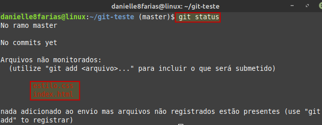

# git add: Adicionando arquivos no Git

Entre na pasta a qual você pretende fazer o versionamento e no terminal digite:

```
$ git init
```

- o símbolo **$** indica que você deve usar o **usuário comum** para fazer essa operação.

Desse modo a pasta **.git** será criada. É essa pasta que armazenará as imagens das versões do projetos criados.

Para saber o estado atual do git, basta digitar:

```
$ git status
```

O retorno do terminal será:


No fluxo do git, temos:


Vamos criar alguns arquivos para teste:

```
$ touch arquivo1 arquivo2
```

- o comando **touch** serve para criar arquivos no Linux.

Digitando novamente o git status, temos:



No fluxo do git, temos: 


Para adicionar os dois arquivos fazemos

```
$ git add arquivo1
$ git add arquivo2
```

Ou

```
$ git add arquivo1 arquivo2
```

Para adicionar todos os arquivos do diretório

```
$ git add .
```

Para adicionar todos os arquivos de uma determinada extensão

```
$ git add *.txt
```

- supondo que a extensão aqui seja txt.

Verificando o estado do git, temos:


Aqui, estamos no **index (staging area)**. Algo como uma sala de espera do git.


É a partir daqui que poderemos realizar o **commit**.

tags: git, init, add, status
