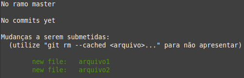
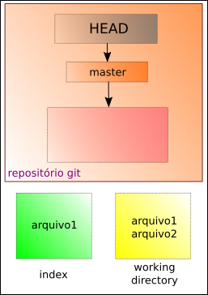

# Removendo arquivos do index

Vamos supor que temos dois arquivos:

```
$ ls
```

- o comando **ls** serve para que o terminal retorne os diretórios e arquivos contidos no local onde o terminal está.
- o símbolo **$** indica que você deve usar o **usuário comum** para fazer essa operação.

Será exibido

```
arquivo1 arquivo2
```

Ao adicionarmos os dois ao git

```
$ git add arquivo1 arquivo2
```

ou

```
$ git add .
```

percebemos que adicionamos o arquivo2 sem querer. 



Logo, no fluxo do Git temos,


Assim, para removê-lo usamos o comando:

```
git rm --cached arquivo2
```

Se este for nosso primeiro commit ou

```
$ git reset HEAD arquivo2
```

Se não for nosso primeiro commit.

No fluxo do Git teremos nosso arquivo removido do **index**.



O que pode ser conferido através do comando

```
$ git status
```

tags: git, reset, index, head
