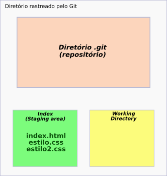

# git rm/reset: Removendo arquivos do index


> Continuando o [episódio anterior](p0002_add.md)...

## Remoção antes do primeiro commit

Temos no nosso diretório que está sendo monitorado pelo **Git** os seguintes arquivos:


No **fluxo** do git, temos:


Como podemos ver, ainda não temos **commits**.

Vamos criar e adicionar ao **index** um terceiro arquivo:


Observando o fluxo do **Git**:



Vamos supor que adicionamos esse arquivo estilo2.css sem querer. Não era o que queríamos. Então devemos tirá-lo do **index**. Observe que o próprio terminal nos dá uma dica de como fazê-lo:


Esse é exatamente o comando que vamos utilizar aqui.

```
$ git rm --cached estilo2.css
```

- **$** indica que você deve usar o **usuário comum** para fazer essa operação.

Utilizando o comando ```git status```, temos:


No fluxo do **Git**, temos:


Para mais de um arquivo, podemos usar o comando

```
$ git rm --cached -r *
```

- **-r** de recursivo, ou seja, inclui subdiretórios, se houver.

- __*__, asterisco; todos os arquivos.


## Remoção após o primeiro commit

Caso não seja o primeiro commit e você precise excluir um arquivo do **index**, utilize o comando:

```
$ git reset HEAD <arquivo>
```

- **reset**; redefinir.

- **HEAD** é um ponteiro que normalmente aponta para o **último commit**.

- digite o nome do arquivo sem os sinais **< >**.

O que esse comando faz é uma cópia do **head** para o **index**; retirando o arquivo que estava no index antes.

No nosso exemplo,


```
$ git reset HEAD estilo2.css
```


Caso seja mais de um arquivo, digite:

```
$ git reset HEAD .
```

- **ponto** é o diretório atual. Isso quer dizer que ele vai incluir todos os arquivos e subdiretórios que estão no **index**.

Exemplo:


tags: git, reset, index, head, rm
