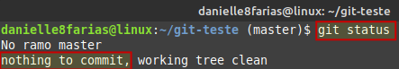

# git commit: Enviando arquivos para o repositório Git


Após adicionar arquivos no **index**, [clique aqui caso não saiba adicionar](p0002_add.md), precisamos levar esses arquivos para dentro do nosso repositório.

Até agora temos:


Enquanto no **fluxo** do git,


Ao colocar os arquivos dentro no repositório, precisamos informar ao **Git** o motivo desses arquivos, com o comando:

```
$ git commit -m 'escreva sua mensagem aqui'
```

- **$** indica que você deve usar o **usuário comum** para fazer essa operação.

- pode-se usar aspas simples ou duplas para escrever a mensagem.

No nosso exemplo, temos:

```
$ git commit -m 'commit inicial'
```


Conferindo o **estado** do **Git**, temos:



E no fluxo,


Esse conjunto de caracteres e números que aparece ao lado da palavra **commit** é a **chave (ou hash)** que identifica o próprio.

tags: git, commit, add, status
