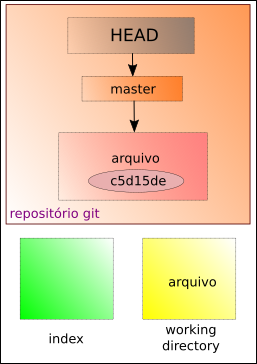

# Enviando arquivos para o repositório Git

Depois de usar o comando de adicionar arquivos no git
```
$ git add <arquivo>
```
Para confirmar as alterações e enviar os arquivos para o seu repositório, fazemos
```
$ git commit -m "escreva sua mensagem aqui"
```
A mensagem descrita entre aspas duplas serve para identificar a ação sobre os arquivos.

Conferindo o estado do git, temos algo como
```
No ramo master

nothing to commit, working tree clean
```


> abaixo do nome do arquivo está escrito a chave (ou hash) que identifica o commit

tags: git, commit, add, status
