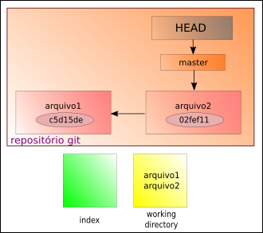
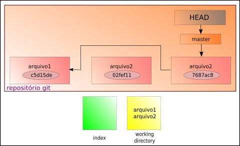
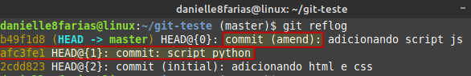
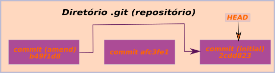
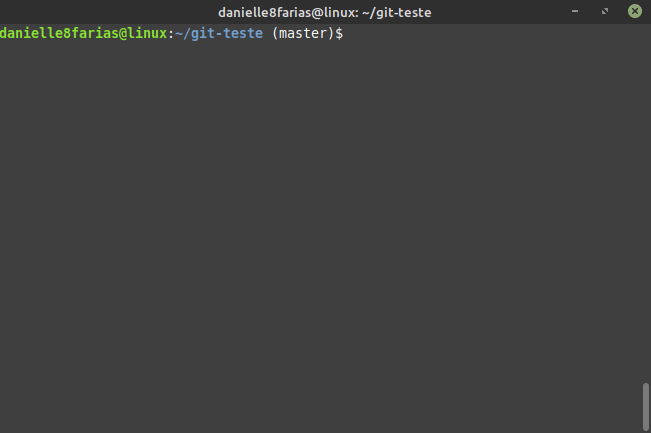
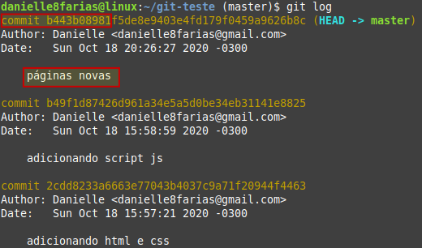
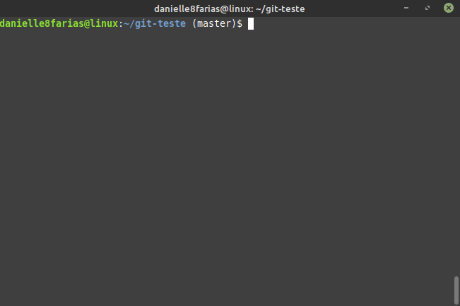
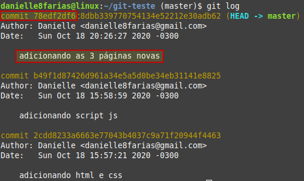

# git commit --amend: Corrigindo o último commit


## Mensagem de commit errada

Vamos supor que adicionei dois arquivos com os seguintes commits:

```
$ git add index.html estilo.css
$ git commit -m 'adicionando arquivo html e css'
```

- **$** indica que você deve usar o **usuário comum** para fazer essa operação.
- **add** para adicionar arquivos ao **index**.
- **commit** é quem vai levar os arquivos do **index** para o **repositório git**.
- **-m** indica que você irá escrever uma mensagem para registrar o **commit**.
- **' '** a mensagem vem entre aspas simples ou duplas.

E em seguida, adiciono mais outro, mas com o **commit errado**:

```
$ git add script.js
$ git commit -m 'script python'
```

Como é possível constatar, escrevi errado o commit desse arquivo.

Antes de consertá-lo, vamos dar uma olhada nos commit feitos até agora:

```
$ git log
```



Perceba que cada um tem sua própria chave (a sequência de caracteres com letras e números ao lado da palavra commit).

Vamos modificar o **último commit** com o seguinte comando:

```
$ git commit --amend -m 'adicionando script js'
```

Agora, vamos usar utilizar o comando para ver os commits que foram feitos:



Observe que a chave do nosso último commit é diferente da anterior (antes da correção).

Para entender melhor o que aconteceu, vamos usar um outro comando, mais poderoso do que o **git log**.

```
$ git reflog
```

- **reflog** mantém o registro (de 30 dias) de cada posição do ponteiro HEAD do seu repositório.



Com ele podemos verificar o nosso commit errado e a sua correção.

No **fluxo** do git, temos:




## Arquivo esquecido

Outro problema que pode ocorrer, e que também é resolvido com o comando **--amend**, é de adicionar arquivos ao repositório, dar commit, mas ter faltado um arquivo que você queria que fizesse parte desse commit.

Exemplo:



No exemplo acima, esquecemos de adicionar o arquivo **playstation.html**.

Usando o comando **git log**, temos:



Fazendo a correção:



Usando **git log** novamente:




## Pequenas alterações no arquivo

Caso você tenha acabado de fazer um **commit**, mas precisou fazer uma pequena alteração no arquivo logo em seguida, então digite:

```
$ git add <nome_do_arquivo>
```

Para colocar as alterações no **index** e em seguida:

```
$ git commit --amend --no-edit
```

Agora seu último **commit** contém a alteração do arquivo.

**Atenção: não usar esse comando com commits que já foram enviados para o repositório remoto.**

tags: git, log, commit, alteracao, amend
