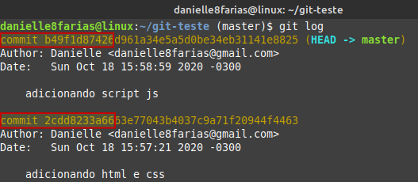

# git commit --amend: Corrigindo o último commit


Vamos supor que adicionei dois arquivos com os seguintes commits:

```
$ git add index.html estilo.css
$ git commit -m 'adicionando arquivo html e css'
```

- **$** indica que você deve usar o **usuário comum** para fazer essa operação.
- **add** para adicionar arquivos ao *index*.
- **commit** é quem vai levar os arquivos do *index* para o *repositório git*.
- **-m** indica que você irá escrever uma mensagem para registrar o *commit*.
- **' '** a mensagem vem entre aspas simples ou duplas.

E em seguida, adiciono mais outro, mas com o commit errado:

```
$ git add script.js
$ git commit -m 'script python'
```

Como é possível constatar, escrevi errado o commit desse arquivo.

Antes de consertá-lo, vamos dar uma olhada nos commit feitos até agora:

```
$ git log
```


Perceba que cada um tem sua própria chave.

Vamos modificar o último commit com o seguinte comando:

```
$ git commit --amend -m 'adicionando script js'
```

Agora, vamos usar utilizar o comando para ver os commits que foram feitos:



Observe que a chave do nosso último commit é diferente.

Para entender melhor o que aconteceu, vamos usar um outro comando, mais poderoso do que o *git log*.

```
$ git reflog
```


Podemos conferir a mudança através do comando:

```
$ git log --oneline
```

Um problema que pode ocorrer, que também é resolvido com o comando **--amend** é de adicionar um arquivo ao repositório, dar commit, e ainda ter faltado arquivo para esse commit anterior. Exemplo:

Temos os arquivos 1 e 2 que devem fazer parte de um mesmo commit

```
$ git add arquivo1
$ git commit -m "atualização"
```

Adicionado o arquivo esquecido

```
$ git add arquivo2
$ git commit --amend -m "atualização (edit)"
```

Desse modo o **commit** foi corrigido.

Caso você tenha acabado de fazer um commit, mas precisou fazer uma pesquena alteração no arquivo logo em seguida

```
$ git commit --amend --no-edit
```

Agora seu último commit contém a alteração

**Atenção: não usar esse comando com commits que já foram enviados para o repositório remoto.**

tags: git, log, commit, alteracao
