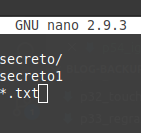
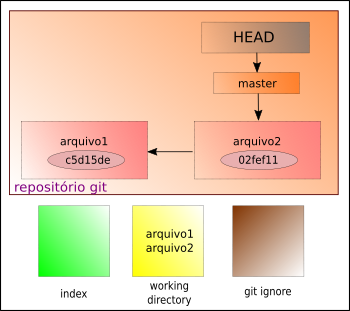

# Ignorando arquivos no Git

Caso você queira que o git não enxergue determinados arquivos dentro do mesmo diretório do repositório, precisamos criar o seguinte arquivo:

```
$ touch .gitignore
```

- o símbolo **$** indica que você deve usar o **usuário comum** para fazer essa operação.
- o comando **touch** serve para criar arquivos no Linux.

Abrindo esse arquivo, vamos digitar dentro dele o que queremos deixar de fora do repositório. Exemplo:

Ocultando do git uma pasta ou um diretório. Temos



Assim temos uma pasta como primeiro item, pois ela termina com a barra.

No terceiro item estamos adicionando na lista qualquer arquivo que termine com a extensão **txt**.

É importante notar que devemos informar um tipo de arquivo por linha.

Dentro desse diretório exemplo, temos:

```
$ ls
changelog  readme  secreto/  secreto1  secreto2.txt
```

Quando verificamos o estado do git teremos:

```
No ramo master
Arquivos não monitorados:
  (utilize "git add <arquivo>..." para incluir o que será submetido)

	.gitignore

nada adicionado ao envio mas arquivos não registrados estão presentes (use "git add" to registrar)
```

No fluxo do Git temos,



Os arquivos descritos dentro do arquivo **.gitignore** não aparecem no estado atual do Git.

tags: git, ignore, diretorio, arquivo
