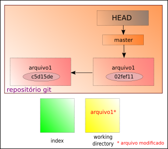

# Adicionando um arquivo modificado no Git

Para adicionar um arquivo que foi modificado ao repositório, existem dois caminhos.

```
$ git add <nome do arquivo>
```

seguido do **commit**

```
$ git commit -m "sua mensagem aqui"
```

- o símbolo **$** indica que você deve usar o **usuário comum** para fazer essa operação.
- substitua o \<nome do arquivo> pelo nome do seu arquivo sem os sinais **<>**

Ou através de um atalho:

```
git commit -am "commit e adição de modificação juntos"
```

O parâmetro **-a** adiciona todos os arquivos que foram modificados, sem a necessidade de adicionar cada um individualmente.



tags: git, modificado, add, commit
