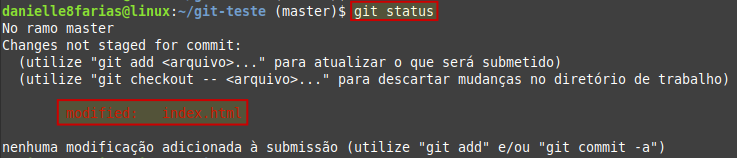

# git commit -am: Atualizando arquivo modificado no Git


Para atualizar um arquivo que foi modificado no repositório, existem dois caminhos.

```
$ git add <arquivo>
```

- **$** indica que você deve usar o **usuário comum** para fazer essa operação.
- **add** vai adicionar ao git o(s) arquivo(s) que virá(ão) em seguida.
- digite o nome do arquivo sem os sinais **< >**.

seguido do **commit**

```
$ git commit -m 'sua mensagem aqui'
```

Exemplo:

Aqui temos o arquivo index.html que foi modificado.



Adicionando o arquivo com o comando ```git add```


E fazendo o **commit**


## Atalho

Também é possível fazer o **commit das modificações** através de um **atalho**:

```
git commit -am "commit e adição de modificação juntos"
```

O parâmetro **-a** adiciona todos os arquivos que foram modificados, sem a necessidade de adicionar cada um individualmente.

Exemplo:

Aqui temos vários arquivos modificados


Usando o atalho


tags: git, modificado, add, commit -a, commit -am
