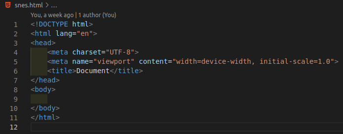

# git diff: Verificando modificações no repositório

Para saber o que foi modificado em um arquivo do repositório, mas que ainda não foi adicionado, usamos o comando:

```
$ git diff
```

- o símbolo **$** indica que você deve usar o **usuário comum** para fazer essa operação.

Exemplo:

Temos o arquivo inicial abaixo



Em seguida, fizemos as seguintes modificações


Ao digitar o comando **diff**, temos:


Assim podemos ver (escrito em **verde**) quais partes do arquivo foram **adicionadas**. 


Em **vermelho**, as partes que foram **retiradas ou modificadas**. 


E o que está escrito com a cor **branca** aquilo que foi **mantido** (não houve modificação).


Para verificar as mudanças dos arquivos que estão no **index**, usamos o comando:

```
$ git diff --staged
```

Para verificar todos os commit feitos, usamos

```
$ git log
```

O retorno será o histórico de todos os **commits**, do último ao primeiro, e uma **chave** para cada um deles, em amarelo (mostarda). É através dessa **chave** que fazemos a transição entre as versões do arquivo/projeto.


O comando

```
$ git log -p
```

faz a junção dos comandos **log** e **diff**. Pressione ENTER para descer a página e ao chegar ao fim, pressione **q**.

Com o comando

```
$ git log -p -<n>
```

sendo o **\<n>** o número de commits que gostaria de ver, a partir do último.

tags: git, diff, staged, log
