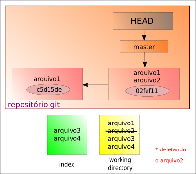
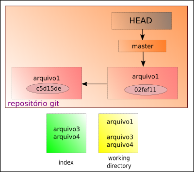

# Deletando arquivo do repositório

Para apagar um arquivo ou diretório no repositório Git, fazemos

```
$ git rm <arquivo>
```

- o símbolo **$** indica que você deve usar o **usuário comum** para fazer essa operação.

No fluxo do Git, temos





É possível remover mais de um arquivo ao mesmo tempo, basta colocar os nomes dos arquivos a serem removidos em sequência.

```
$ git rm arquivo1 arquivo2
```

Para finalizar, basta fazer o **commit** dessas remoções.

tags: git, remove, rm, delete
