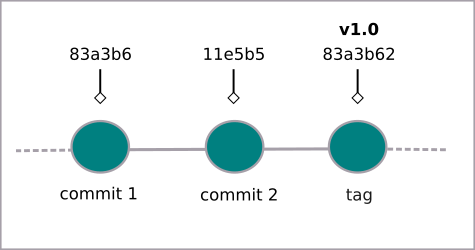

# git tag: Etiquetas no Git

## Criando etiquetas

Etiquetas servem para melhor identificar os arquivos que estão sendo trabalhados. Para criar uma etiqueta usamos

```
$ git tag -a nome_da_etiqueta -m "insira sua mensagem aqui"
```

- o símbolo **$** indica que você deve usar o **usuário comum** para fazer essa operação.

Exemplo:

```
$ git tag -a v1.0 -m "versão 1.0"
```



Para verificar todas as etiquetas digite

```
$ git tag
```

E o retorno serão todas as etiquetas já criadas.

É importante notar que a etiqueta é criada no **commit** atual. Para criar uma etiqueta em um **commit** passado fazemos

```
$ git tag -a nome_da_etiqueta chave_do_commit -m "insira sua mensagem aqui"
```

Exemplo:

```
$ git tag -a v0.1 c5d15de -m "versão beta"
```

Para verificar a **chave do commit** use o comando

```
$ git log --oneline
```

Para saber detalhes de uma etiqueta específica

```
$ git show nome_da_etiqueta
```

## Usando etiquetas (tags) no Git

Para utilizar a etiqueta, usa-se o comando:

```
$ git checkout nome_da_etiqueta
```

Desse modo é possível visualizar o projeto a partir do **commit** associado a essa etiqueta.

Para voltar ao estado original

```
$ git checkout nome_do_ramo_original
```

Para excluir uma etiqueta, digite

```
$ git tag -d nome_da_etiqueta
```

tags: git, tag, etiqueta, show
