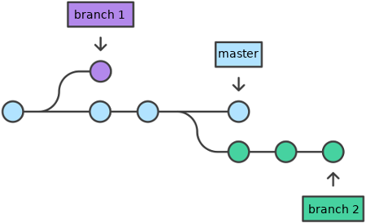
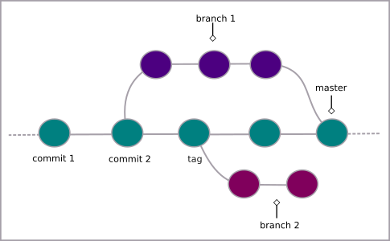

# O que são branches (ramos) no Git?

De maneira simplificada, os **ramos (branches)** no Git são semelhantes a um ramo de uma árvore, onde o tronco seria a base do código. Desse modo é possível criar diversos ramos e fazer alterações, enquanto a base permanece intacta. Por padrão o ramo principal é denominado de **master**.



## Criando branch

Para criar um **branch**, digite

```
$ git branch <nome do ramo>
```

- o símbolo **$** indica que você deve usar o **usuário comum** para fazer essa operação.
- substitua o \<nome do ramo> pelo nome que deseja dar ao seu ramo **(branch)** sem os sinais **<>**

Para ir até o **branch** criado

```
$ git checkout <nome do ramo>
```

Para usar um atalho para esses comandos acima

```
$ git checkout -b <nome do ramo>
```

Desse modo o **branch** será criado e em seguida irá transferi-lo para lá.

## Listar branch

Para listar todos os **branches**, usa-se o comando:

```
$ git branch
```

## Excluindo branch

Para excluir um **branch**, digite

```
$ git branch -d <nome do ramo>
```

## Unindo branch

Para unir todas as modificações que foram feitas em diferentes **branches**, ao ramo principal do projeto, digite

```
$ git checkout master
```

para ir até o **branch principal** ou

```
$ git checkout <nome do ramo>
```

para ir até o **branch** (ramo) de destino das alterações.

Então digite

```
$ git merge <nome do ramo onde as alterações foram feitas>
```

O fluxo dos **branches** será algo como a figura abaixo (unindo **branch 1** a **master**)



Para visualizar os **commits** de **merge**:

```
 $ git log --merges 
```

tags: git, branch, checkout, merge
