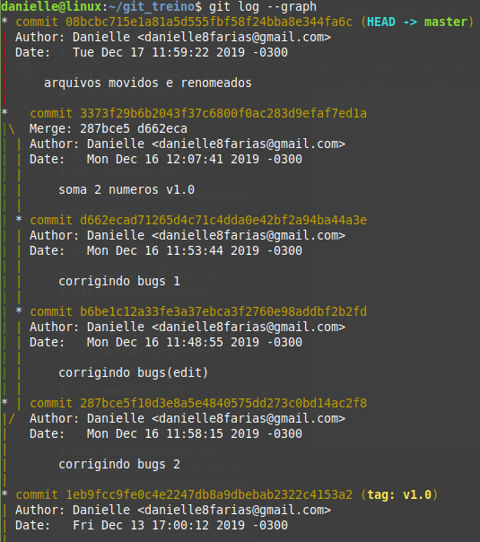

# Visualizando grafo de commits

Para visualizar o grafo de commits, digite:

```
$ git log --graph
```

- o símbolo **$** indica que você deve usar o **usuário comum** para fazer essa operação.

Abaixo, um exemplo do retorno.



tags: git, grafo, commit, log
