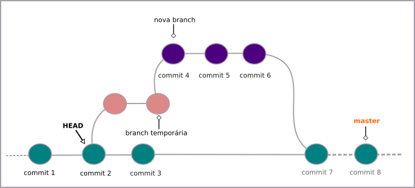
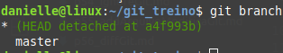
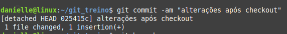

# Desfazendo commits (checkout)

Uma forma de desfazer **commits** é usando o **checkout**.

Para voltar ao **commit** anterior, digite:

```
$ git checkout HEAD~1
```

- o símbolo **$** indica que você deve usar o **usuário comum** para fazer essa operação.

Aqui é importante notar que será criado um **branch temporário**.



Você pode confirmar isso através do comando

```
$ git branch
```

O retorno será algo semelhante a:



Nesse ponto, você estará visualizando as alterações que foram feitas até esse **commit**.

Após fazer os testes e/ou alterações, basta fazer o commit. Aqui será apresentado uma chave ao lado do commit. Exemplo:



Para não perder as informações é necessário criar um novo **branch**, desse jeito:

```
$ git branch <nome do novo ramo> <chave do útimo commit>
```

- substitua o \<nome do novo ramo> e \<chave do último commit> por seus respectivos nome e chave, sem os sinais **<>**

Em seguida basta ir até o novo **branch** criado com o comando

```
$ git checkout <nome do novo ramo>
```

tags: checkout, git, commit, head
