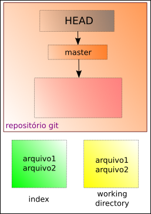
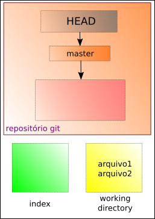
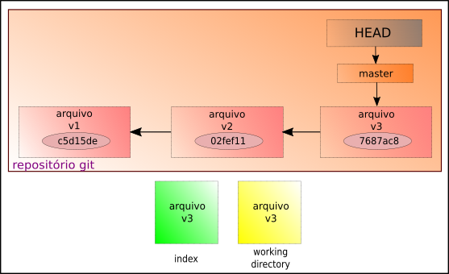
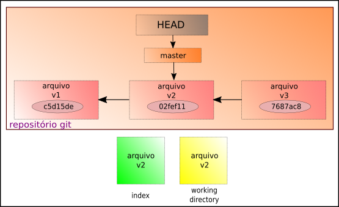

# git reset: Desfazendo commits

O comando **reset** pode ser usado para retirar arquivos do index. Exemplo:



Através do comando:

```
$ git reset arquivo1 arquivo2
```

- o símbolo **$** indica que você deve usar o **usuário comum** para fazer essa operação.

Teremos:



Supondo que temos pelo menos três **commits** de um mesmo arquivo, ou seja, fizemos três atualizações do nosso repositório.



Para voltar ao **commit** anterior, com o **reset**

```
$ git reset HEAD~
```


É importante notar que esse comando altera o **head** e o **index**, mas não o working directory.

A mesma situação vale para o comando

```
$ git reset chave_do_commit
```

Que é equivalente a

```
$ git reset --mixed chave_do_commit
```

Para alterar apenas o **head** usamos o comando:

```
$ git reset --soft chave_do_commit
```


Para alterar o **head**, o **index** e o **working directory** usamos:

```
$ git reset --hard chave_do_commit
```



Para voltar apenas para o último **commit**:

```
$ git reset --hard HEAD~
```

De maneira resumida, temos:


tags: git, reset, soft, hard
