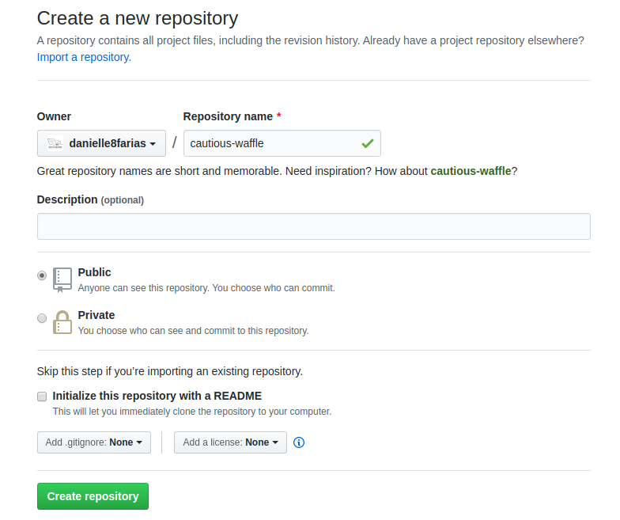
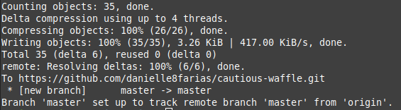

# Enviando um projeto para o repositório remoto no GitHub


Acesse sua conta no [GitHub](https://github.com/). Caso ainda não tenha, basta criá-la (é fácil e rápido).

Clique o sinal de mais para abrir o menu e em seguida em **New repository**.


Dê o nome de sua preferência, além da descrição e indique se seu repositório será público ou privado.



Para finalizar, clique em **Create repository**.

Em seguida aparece uma tela com três opções:


- A primeira diz respeito a crianção de um **novo repositório** (inclui a inicialização do Git no diretório).

- A segunda diz respeito a um **repositório já existente** e que desejo colocar no GitHub (é a situação que irei utilizar).

- A terceira diz respeito a **importação** de um código de outro repositório.

Sendo assim, dentro da pasta do nosso projeto, digitamos o comando:

```
$ git remote add origin <link para o repositório do seu projeto>
```

para fazer a ligação com o repositório remoto.

- o símbolo **$** indica que você deve usar o **usuário comum** para fazer essa operação.
- substitua o \<link para o repositório do seu projeto> pelo link sem os sinais **<>**

No meu caso:

```
$ git remote add origin https://github.com/danielle8farias/cautious-waffle.git
```

Logo após

```
$ git push -u origin master
```

Isso significa as modificações no **branch(ramo)** local, denominado **master** será **empurrado(push)** para o remoto chamado **origin**. O **-u** é uma atalho para o comando **--set-upstream**; ficando definido esse **branch** como uso padrão até que você o modifique novamente.

Em seguida, será pedido seu **nome de usuária** e sua **senha do GitHub**:


Se tudo estiver certo o retorno será algo similar a:



Fazendo a associação entre os branchs **master(local)** e **origin(remoto)**.

tags: git, github, repositorio, remoto
