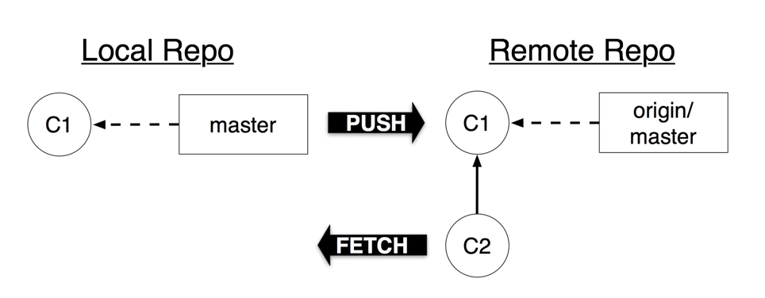

# git fetch: Verificando commits remotos

Precisamos entender que, após criarmos um conta no **GitHub** e fazermos o upload do nosso código, temos dois repositórios: o local e o remoto.

O repositório remoto é como um espelho do nosso repositório local a cada vez que usamos o comando **git push**.

Sendo assim, quando estamos trabalhando em um projeto com mais de uma pessoa, teremos que verificar os **commits** que foram feitos por outras pessoas da nossa equipe.



Fazemos isso através do comando:

```
$ git fetch
```

Esse comando captura do repositório remoto todos os **branches** e **tags** novos sem fazer **merge** dessas alterações em seu repositório local.

Caso você queira puxar as mudanças, mas sem que elas afetem seu branch principal:

```
$ git fetch origin nome_do_branch
```

> caso não lembre como criar branches, [clique aqui](git/p0012_branch.md).

Para verificar as diferenças entre os códigos dos repositórios, digite:

```
$ git diff origin/master
```

Caso queira ter a versão remota no seu **working directory**, será preciso fazer o **merge** destes **commits**.

```
$ git merge origin/master
```

Ao usar o **git fetch** você consegue saber se existem novas mudanças e como elas afetam as suas mudanças locais antes de unir tudo.

tags: fetch, merge, git, origin
