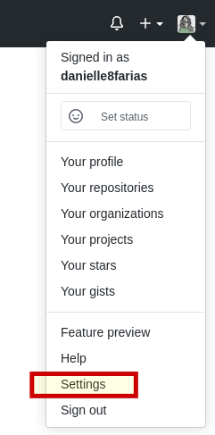

# Acesso ao Github com SSH

A conexão do nosso repositório local com o remoto (Github) se dá por meio de dois protocolos.

O primeiro é o **HTTPS** do inglês, *Hyper Text Transfer Protocol Secure*, em português, Protocolo de Transferência de HiperTexto Seguro. Nele seus **commits** são enviados através do seu **login** e **senha** do **Github**. Essa é a forma com mais segurança e recomendada, principalmente se você usa uma máquina compartilhada.

O segundo é o **SSH** do inglês *Secure Shell*, em português, Cápsula de Segurança. Nele não precisamos informar login e senha para cada acesso. Basta configurar as credenciais uma vez para realizar a conexão com o servidor remoto. É recomendada principalmente se apenas você tem acesso a máquina, pois as chaves são geradas no seu computador.

Primeiro, precisamos verificar se temos o pacote **openssh-client**.

```
$ ssh -V
```

Se estiver instalado, você verá o retorno da tela informando a versão. Geralmente ele já vem instalado por padrão nas distros Ubuntu/Mint/derivadas do Debian.

Caso não esteja, vamos instalá-lo com o comando:

```
$ sudo apt install openssh-client
```

- **$** indica que você deve usar o **usuário comum** para fazer essa operação.

- **sudo** serve para pedir permissões de administrador temporariamente.

- **apt** do inglês, *Advanced Package Tool*, em português, Ferramenta de Empacotamento Avançada; é a ferramenta que nos ajuda na instalação, atualização e desinstalação de programas, entre outras funções.

- **install** é o comando de instalar, indicando ao apt o que fazer.

- **openssh-client** é o nome do pacote que queremos instalar.

Agora iremos para o diretório **home** (caso você não esteja nele)

```
$ cd
```

- **cd**, do inglês, *change directory*, em português, mudar de diretório. Quando passado sem o nome de um diretório, esse comando nos leva a pasta **home**.

E então, podemos gerar a chave:

```
$ ssh-keygen -t rsa -C seu@email.com
```

- **ssh-keygen** é para chamar o gerador da chave.

- **-t** vai indicar o tipo de chave que queremos, no caso **rsa**, *Rivest–Shamir–Adleman*, sigla formada pelas iniciais dos sobrenomes dos criadores desse algoritmo de criptografia.

- **-C** para adicionar como comentário o seu endereço de **email do Github**.

A chave será gerada em:

```
/home/seu_usuario_linux/.ssh/id_rsa
```

Ele perguntará se você deseja gerar a chave nesse diretório. Aperte ENTER para confirmar.

Em seguida ele perguntará se você deseja criar uma senha para a chave e em seguida a confirmação da senha. Caso não deseje criar uma senha para a chave, basta pressionar ENTER nas duas vezes para deixar a senha vazia.

Agora vamos ver se as chaves estão no local:

```
$ ls .ssh
```

- **ls** fará com que o terminal exiba o nome dos arquivos e diretórios no local indicado.

Nosso retorno deve ser:

```
id_rsa id_rsa.pub
```

- **id_rsa** é sua chave privada.

- **id_rsa.pub** é sua chave pública.

Com o comando:

```
$ cat .ssh/id_rsa.pub
```

O terminal retornará nossa chave pública na tela.

- **cat**, do inglês *concatenate*, em português Concatenar, exibe o conteúdo do arquivo que indicamos.

Selecione toda a chave e copie.

Vá até a sua conta do **Github** e no canto superior direito procure por **Settings**. 



Em seguida procure por **SSH and GPG keys**.


Clique em **New SSH key**.


Em **Title** dê um nome que você possa posteriormente identificar onde foi usada essa chave. Exemplo: pc casa.

E em **Key** cole a chave que copiamos anteriormente e depois clique em **Add SSH key** para salvar a chave.


Para saber se fizemos tudo certo, digite no terminal:

```
$ ssh -T git@github.com
```

O terminal perguntará se você deseja continuar a conexão. Responda _**yes**_ para continuar e receber o retorno de autenticação.

Agora você já pode fazer seus **commits, push e pull** com comodidade e **clonar** repositórios via SSH:


tags: ssh, github, rsa,
