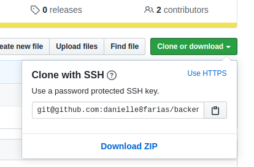

# Reconfigurando diretório HTTPS para SSH

Depois de ter feito a [validação da sua chave SSH com o Github](git/p0021_ssh.md); caso você já tenha na sua máquinas projetos que usam o HTTPS, é possível fazer a troca de de **HTTPS** para **SSH**.

Vá até o repositório desejado e digite, no terminal:

```
$ git remote -v
```

- **$** indica que você deve usar o **usuário comum** para fazer essa operação.

O retorno será algo como:

```
origin	https://github.com/danielle8farias/potential-broccoli.git (fetch)
origin	https://github.com/danielle8farias/potential-broccoli.git (push)
```

Observe que após a palavra **origin** temos o endereço do nosso repositório remoto iniciando com **https**. Isso indica o nosso tipo de conexão.

Para fazer a troca para **SSH**, digite:

```
$ git remote set-url origin sua_url_ssh
```

No meu caso, temos:

```
$ git remote set-url origin git@github.com:danielle8farias/potential-broccoli.git
```

Se você não souber sua url ssh, ela é encontrada no Github na parte de **clone or download**, do seu repositório.




Verificando nosso repositório novamente

```
$ git remote -v
```

temos o retorno:

```
origin	git@github.com:danielle8farias/potential-broccoli.git (fetch)
origin	git@github.com:danielle8farias/potential-broccoli.git (push)
```

Indicando que a troca foi feita com sucesso.

Caso queira fazer a troca de SSH para HTTP, basta fazer o caminho inverso desse.

tags: https, ssh, git
