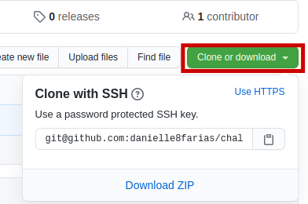

# git clone: Copiando um repositório existente

Vá até o diretório na sua máquina em que você deseja colocar o repositório e digite no terminal:

```
$ git clone url_do_repositorio_que_deseja_copiar
```

- **$** indica que você deve usar o **usuário comum** para fazer essa operação.

Caso deseje copiar, além do branch padrão, algum outro branch do repositório, digite:

```
$ git fetch origin nome_do_branch_remoto:nome_que_deseja_dar_para_o_branch_local
```

Para pegar o link, vá até o repositório remoto desejado e na parte direita clique no botão **clone or download**, como mostrado na imagem abaixo.



tags: git, clone, fetch, repositorio
