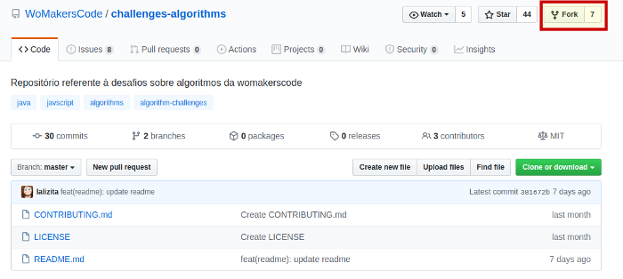
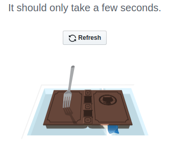
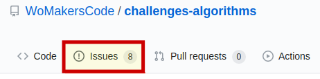
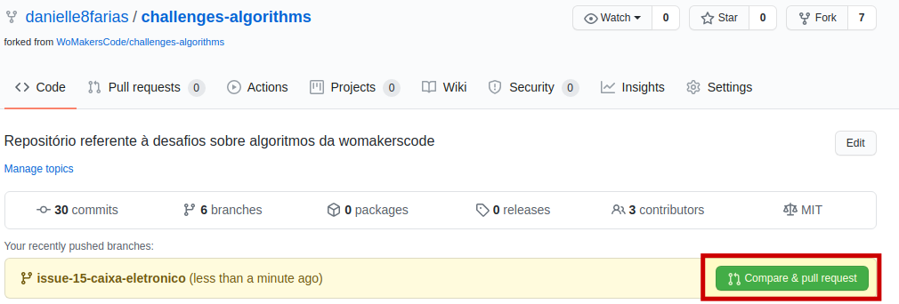
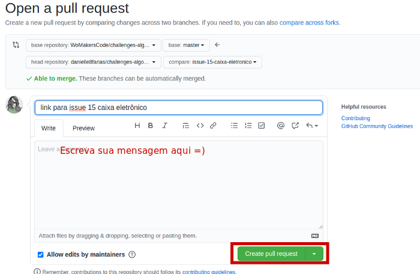
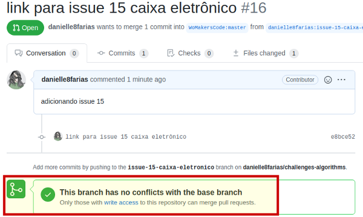

# fork: Como colaborar com projetos de código aberto

Primeiro é preciso que você tenha uma conta em alguma plataforma de hospedagem de código-fonte que faça uso do Git. Nesse exemplo, usaremos o [Github](https://github.com/).

Vá até o repositório desejado e procure pelo botão **Fork**.



Ele começará o processo 



E em seguida você será redirecionada para sua conta e poderá notar abaixo do nome do repositório, a origem desse


Agora precisamos trazer o repositório para a nossa máquina.

No repositório, procure pelo botão **clone or download**.


Copie o link e digite no terminal:

```
$ git clone link_do_repositorio
```

- **$** indica que você deve usar o **usuário comum** para fazer essa operação.

No meu caso, será:

```
$ git clone git@github.com:danielle8farias/challenges-algorithms.git
```

Recomenda-se (boas práticas) criar um **branch** para manter as suas alterações separadas

```
$ git checkout -b nome_do_novo_branch
```

Agora você pode alterar o projeto sem qualquer dano ao repositório original.

Depois de feitas todas as alterações necessárias e commits, você provavelmente desejará enviá-las para o seu repositório remoto e para repositório original (já que a sua ideia é contribuir).

Primeiro precisamos verificar nosso repositório remoto

```
$ git remote -v
```

Se ele retornar apenas seus repositório, desse modo:

```
origin	git@github.com:danielle8farias/challenges-algorithms.git (fetch)
origin	git@github.com:danielle8farias/challenges-algorithms.git (push)
```

Então é preciso adicionar a ligação com o repositório original. Assim:

```
$ git remote add upstream url_do_repositorio_remoto_original
```

No meu caso,

```
$ git remote add upstream git@github.com:WoMakersCode/challenges-algorithms.git
```

Verificando novamente o repositório remoto

```
$ git remote -v
```

temos o retorno algo parecido com

```
origin	git@github.com:danielle8farias/challenges-algorithms.git (fetch)
origin	git@github.com:danielle8farias/challenges-algorithms.git (push)
upstream	git@github.com:WoMakersCode/challenges-algorithms.git (fetch)
upstream	git@github.com:WoMakersCode/challenges-algorithms.git (push)
```

Agora, antes de empurrar seu código, é uma boa prática ir até a página do repositório que você está colaborando e clicar na parte de **issues** para criar um tópico novo **(new issue)**, descrevendo sobre a sua colaboração, quais problemas você pretende solucionar, etc. Ou indo em um tópico já criado para ajudar a solucioná-lo.



Agora, empurre seu código para o seu **fork** através do comando

```
$ git push origin nome_do_branch
```

Feito isso, vá até o seu repositório no Github e perceba que apareceu algo novo:



Clique sobre ele e abrirá uma nova tela:



Escreva sua mensagem e clique em **create pull request**.

A mensagem de retorno será algo como




Caso deseje baixar as alterações de um repositório ao qual você fez o **fork**, **clone** ou contribuiu, digite:

```
$ git pull upstream master
```

tags: fork, git, pull request
