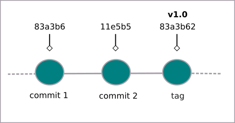

# Criando etiquetas (tags) no Git

Etiquetas servem para melhor identificar os arquivos que estão sendo trabalhados. Para criar uma etiqueta usamos
```
$ git tag -a <etiqueta> -m "insira sua mensagem aqui"
```

Exemplo:
```
$ git tag -a v1.0 -m "versão 1.0"
```



Para verificar todas as etiquetas digite
```
$ git tag
```
E o retorno serão todas as etiquetas já criadas.

É importante notar que a etiqueta é criada no commit atual. Para criar uma etiqueta em um commit passado,
```
$ git tag -a <etiqueta> <chave do commit> -m "insira sua mensagem aqui"
```

Exemplo:
```
$ git tag -a v0.1 c5d15de -m "versão beta"
```

Para verificar a chave do commit use o comando
```
$ git log --oneline
```

Para saber detalhes de uma etiqueta específica
```
$ git show <etiqueta>
```

tags: git, tag, etiqueta, show
