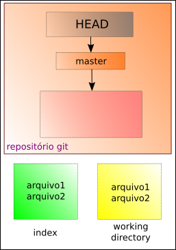
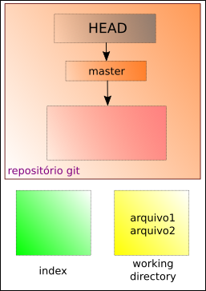
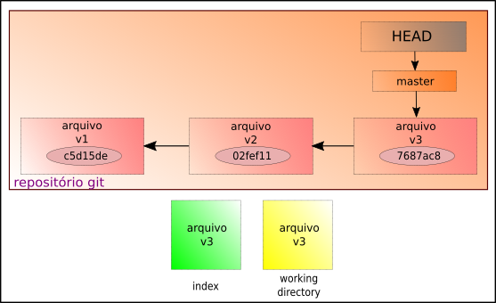

# Desfazendo commits (entendendo o reset)

O comando **reset** pode ser usado para retirar arquivos do index. Exemplo:



Através do comando:
```
$ git reset arquivo1 arquivo2
```
Teremos:



Supondo que temos pelo menos três commits de um mesmo arquivo, ou seja, fizemos três atualizações do nosso repositório.



Para voltar ao commit anterior, com o **reset**
```
$ git reset HEAD~
```


É importante notar que esse comando altera o **head** e o **index**, mas não o working directory.

A mesma situação vale para o comando
```
$ git reset <chave do commit>
```
Que é equivalente a
```
$ git reset --mixed <chave do commit>
```

Para alterar apenas o **head** usamos o comando:
```
$ git reset --soft <chave do commit>
```


Para alterar o **head**, o **index** e o **working directory** usamos:
```
$ git reset --hard <chave do commit>
```


Para voltar apenas para o último commit:
```
$ git reset --hard HEAD~
```

De maneira resumida, temos:


tags: git, reset, soft, hard
