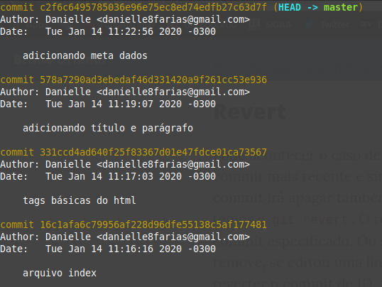
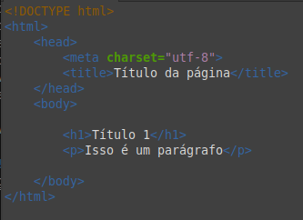
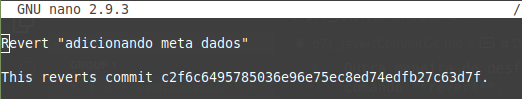

# Desfazendo commits (revert)

Outra maneira de desfazer commits é usando o comando **revert**.

O que esse comando faz é basicamente desfazer tudo aquilo que foi feito dentro de um determinado commit (ou dentro de um intervalo de commits). Por exemplo: se em um commit adicionou um arquivo, o **revert** remove; se o commit editou algumas linhas, o **revert** volta essas linhas ao que eram antes da edição e assim por diante.

Vamos supor que temos a seguinte situação:





Se queremos reverter para a situação de antes de adicionar os meta dados, basta usar o seguinte comando:
```
$ git revert c2f6c649
```
Note que devemos apontar exatamente para o commit que desejamos reverter e não um anterior a ele.

Em seguida o git abrirá o editor que foi selecionado como padrão para editar o commit de reversão.



Teremos como retorno a seguinte mensagem:
```
[master 0967249] Revert "adicionando meta dados"
 1 file changed, 1 deletion(-)
 ```

Caso seja necessário realizar ajustes e correções nos arquivos durante o processo de reversão, será necessário utilizar o comando **git add** após a edição desses arquivos e em seguida o comando
```
$ git revert --continue
```
Para que o processo de reversão seja finalizado.

Também é possível utilizar o revert assim:
```
$git revert HEAD~<número a partir de 1>
```

tags: git, revert, commit, hash

