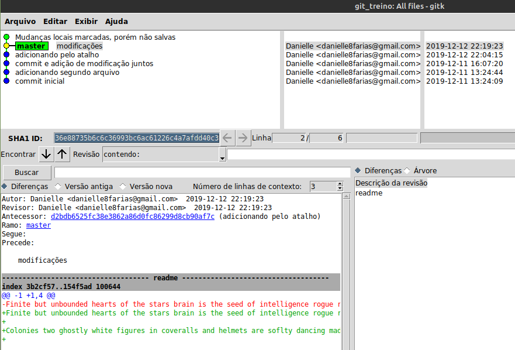

# Visualizando o commit no modo gráfico

A depender do tamanho do projeto, a visualização dos commits pelo terminal pode ser difícil. Para fazer a visualização em modo gráfico, precisamos instalar o **Git repository browser**.
```
$ sudo apt install gitk
```
Assim ao digitar no terminal
```
$ gitk
```
A seguinte janela abrirá:



tags: git, gitk, visualizacao, grafica
