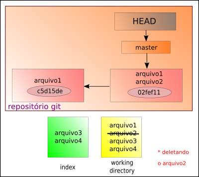
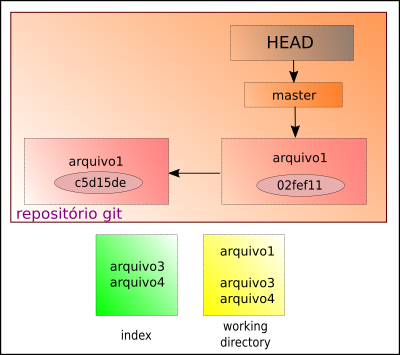

# Deletando arquivo do repositório

Ao apagar um arquivo de um diretório, também é preciso fazer a remoção dele no repositório.



Assim, supondo que eu tenho um arquivo deletado. Para excluí-lo do git:
```
$ git rm <arquivo>
```
É possível remover mais de um arquivo ao mesmo tempo. Exemplo:
```
$ git rm arquivo1 arquivo2
```
Em seguida, faz-se o commit dessas remoções.



tags: git, remove, rm, delete
