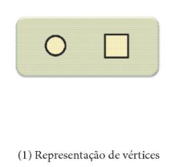
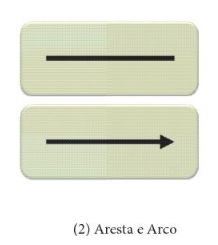
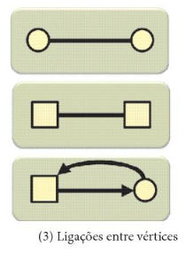

# Grafos

## O que é um grafo?

Matematicamente, um grafo formaliza **relações de interdependência** existentes entre elementos de um conjunto.

Na modelagem de um grafo, os elementos do conjunto que são desenhados como pontos ou círculos são denominados de **nós** ou **vértices**. A relação entre os elementos do conjunto são caracterizados por traços ou seta denominadas de **arestas** ou **arcos**.

São elementos de um grafo:

---

**Referência**

_Goldbarg, M. (2012). Grafos: Conceitos, Algoritmos e Aplicações, página 172. Elsevier._

tags: grafos, vértices, arestas, matemática
