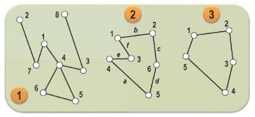
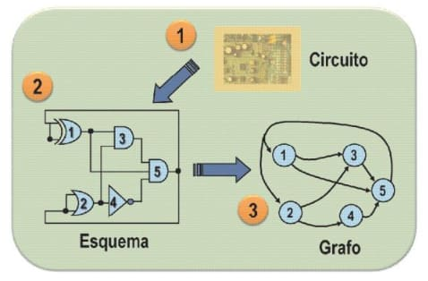

# Representação matemática de grafos

Como já vimos anteriormente, um grafo é uma estrutura abstrata que representa um conjunto de elementos chamado de vértices e suas relações de interdependência com (as arestas).

Denominamos de N o conjunto de vértices e de M o conjunto de arestas. Logo, temos que **G = (N, M)**.

O grafo G1 não possui vértices rotulados. Logo, para G1 temos:

N = {1, 2, 3, 4, 5, 6, 7, 8}
M = {2-7, 7-1, 1-4, 4-6, 4-5, 5-6, 4-3, 3-8}

O grafo G2 possui vértices rotulados. Logo, para G2 temos:

N = {1, 2, 3, 4, 5, 6}
M = {a, b, c, d, e, f}

O grafo G3 não possui vértices rotulados. Logo, para G3 temos:

N = {1, 2, 3, 4, 5}
M = {1-2, 1-5, 2-3, 3-4, 4-5}

Exemplo de uso de um grafo: A formação de um grafo a partir de um esquema de um circuito.

---

**Referência**

_Goldbarg, M. (2012). Grafos: Conceitos, Algoritmos e Aplicações, páginas 172-173. Elsevier._

tags: grafos, conjunto, representação, matemática
