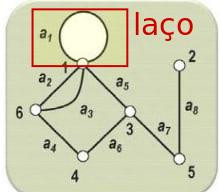

# Tipos de grafos

## Grafo simples

Denominamos de **grafo simples**, um grafo qualquer que não possui **laços** nem **arestas paralelas**.

Uma aresta que liga um vértice a ele mesmo é denominada de **laço**.

Se duas ou mais arestas representam ligações diferentes entre vértices idênticos, são denominadas **arestas paralelas**.

---

**Referência**

_Goldbarg, M. (2012). Grafos: Conceitos, Algoritmos e Aplicações, página 177. Elsevier._

tags: grafos, grafo simples, laços, arestas paralelas
