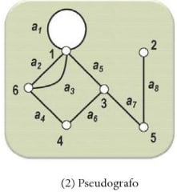

# Tipos de grafos

## Pseudografo

É um grafo que contém **pelo menos um laço**.

---

**Referência**

_Goldbarg, M. (2012). Grafos: Conceitos, Algoritmos e Aplicações, página 177. Elsevier._

tags: grafos, pseudografo, laço
