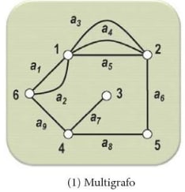

# Tipos de grafos

## Multigrafo

Um grafo não direcionado que possui **pelo menos duas arestas paralelas** é denominado de **multigrafo**. Se o grafo for direcionado, então se chamará **multigrafo direcionado**.

---

**Referência**

_Goldbarg, M. (2012). Grafos: Conceitos, Algoritmos e Aplicações, página 177. Elsevier._

tags: grafos, multigrafo, direcionado, arestas paralelas
